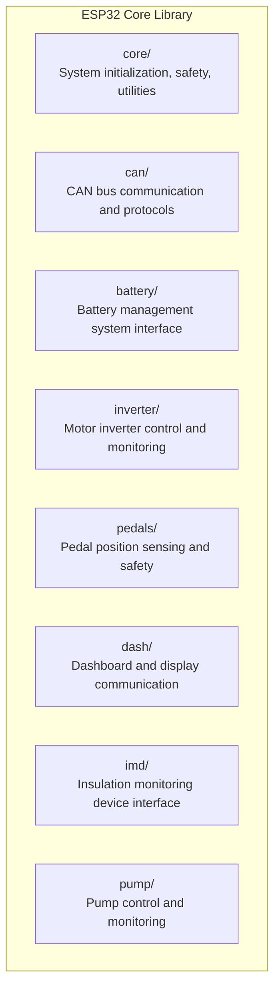
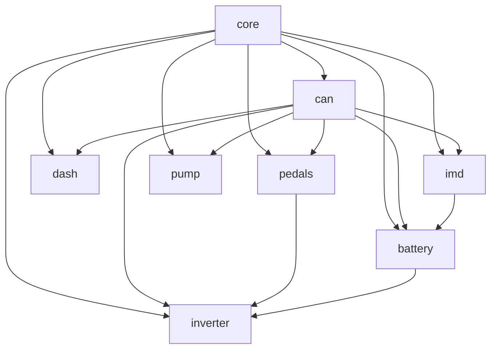
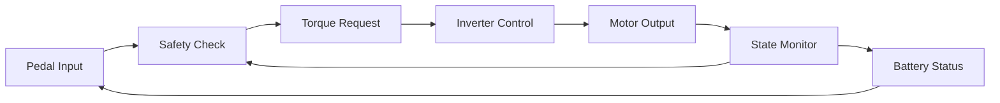
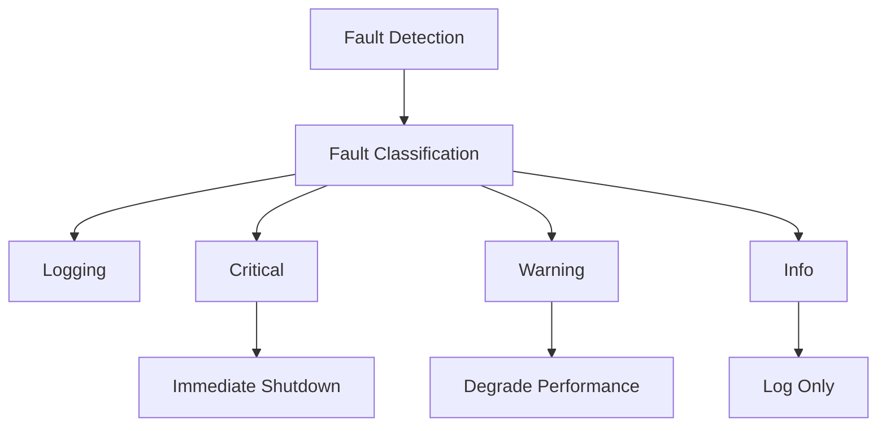

# ESP32 Formula Hybrid Core Library - Internal Architecture

## Purpose
This document defines the **internal architecture of the ESP32 Core Library**, including module relationships, code organization, and software interfaces. For overall vehicle system design, see `Design.md`.

## Safety Classification
- [x] Safety Critical (library architecture affects vehicle safety implementation)

## Library Overview

This ESP32 Core Library provides a **hardware abstraction layer** and **common functionality** for Formula Hybrid race car control systems. It standardizes interfaces between different vehicle subsystems while maintaining safety-critical behavior.

> **Note:** This document covers the **internal software architecture** of the ESP32 library. For overall vehicle system design and subsystem relationships, see [`Design.md`](Design.md).

### **Library Scope**
- **Module interfaces** - Standardized APIs for vehicle components
- **Communication protocols** - CAN, SPI, I2C implementations  
- **Safety frameworks** - Fault detection, heartbeats, emergency handling
- **Hardware abstraction** - ESP32-specific implementations
- **Testing infrastructure** - Unit tests and mocks for all modules

## Component Architecture

### **Module Hierarchy**

### **Module Dependencies**

## Data Flow Architecture

### **Critical Control Loop**

### **Communication Patterns**

**High-Priority Messages (1-10ms):**
- Pedal position data
- Motor control commands
- Emergency shutdown signals
- Heartbeat/safety messages

**Medium-Priority Messages (10-100ms):**
- Battery status updates
- Pump control commands
- Diagnostic data

**Low-Priority Messages (100ms-1s):**
- Dashboard updates
- Telemetry data
- Configuration changes

## Safety Architecture

### **Safety Domains**
1. **Critical Safety Functions**
   - Emergency shutdown
   - Pedal plausibility checking
   - Motor torque limiting
   - Battery protection

2. **Safety Monitoring Functions**
   - Insulation monitoring
   - Temperature monitoring
   - Fault detection and logging

3. **Non-Safety Functions**
   - Dashboard displays
   - Telemetry collection
   - User preferences

### **Fault Handling Strategy**

## Hardware Architecture

### **ESP32 Resource Allocation**

**CPU Cores:**
- Core 0: FreeRTOS system tasks, WiFi, Bluetooth
- Core 1: Application tasks (CAN, safety, control)

**Memory Usage:**
- Program Flash: ~2MB (library + application)
- SRAM: ~100KB (critical data structures)
- PSRAM: Available for telemetry buffering

**Peripheral Assignment:**
- CAN Controller: Built-in TWAI
- SPI: High-speed sensor interfaces
- I2C: Low-speed configuration interfaces
- GPIO: Digital inputs/outputs
- ADC: Analog sensor readings

### **Communication Interfaces**

**Primary:** CAN Bus (500 kbps / 1 Mbps)
- Deterministic timing
- Automotive-grade reliability
- Built-in error detection

**Secondary:** SPI (up to 40 MHz)
- High-speed sensor data
- Display interfaces

**Configuration:** I2C (100/400 kHz)
- Device configuration
- Non-critical sensors

## Performance Requirements

### **Real-Time Constraints**
- **Critical messages:** < 1ms latency
- **Safety functions:** < 5ms response time
- **Control loops:** 10ms maximum cycle time
- **Heartbeat intervals:** 100ms maximum

### **Resource Limits**
- **CPU utilization:** < 80% average, < 95% peak
- **Memory usage:** < 70% of available SRAM
- **CAN bus load:** < 60% utilization
- **Power consumption:** < 500mA @ 12V

## Development Guidelines

### **Module Design Principles**
1. **Single Responsibility:** Each module has one clear purpose
2. **Loose Coupling:** Minimize dependencies between modules
3. **High Cohesion:** Related functions grouped together
4. **Safety First:** All designs prioritize safety over performance
5. **Testability:** All modules must be unit testable

### **Interface Standards**
- **Initialize:** All modules have init() function returning status
- **Process:** Main processing function called from task loop
- **Shutdown:** Safe shutdown function for emergency stops
- **Status:** Health status reporting for diagnostics

### **Error Handling**
- **Return codes:** Standardized error enumeration
- **Logging:** Structured logging with severity levels
- **Recovery:** Graceful degradation when possible
- **Failsafe:** Safe state on unrecoverable errors

## Integration Points

### **External Systems**
- **Vehicle CAN Bus:** Primary communication network
- **Battery Management System:** Power and safety monitoring
- **Motor Controller/Inverter:** Traction control interface
- **Dashboard/HMI:** Driver interface and displays
- **Telemetry System:** Data logging and analysis

### **Development Tools**
- **PlatformIO:** Build system and dependency management
- **Unity:** Unit testing framework with mocks
- **Wokwi:** ESP32 simulation and prototyping
- **CANalyzer/CANoe:** CAN bus analysis and testing

## Future Considerations

### **Scalability**
- Modular design allows adding new components
- CAN protocol designed for extensibility
- Hardware abstraction supports different ESP32 variants

### **Regulatory Compliance**
- Architecture designed for racing regulation compliance
- Safety documentation integrated into design
- Audit trails and logging for technical inspection

---

**Next Steps:**
1. Review and validate architecture with team
2. Implement core module as foundation
3. Define detailed CAN protocol specification
4. Create safety requirements document