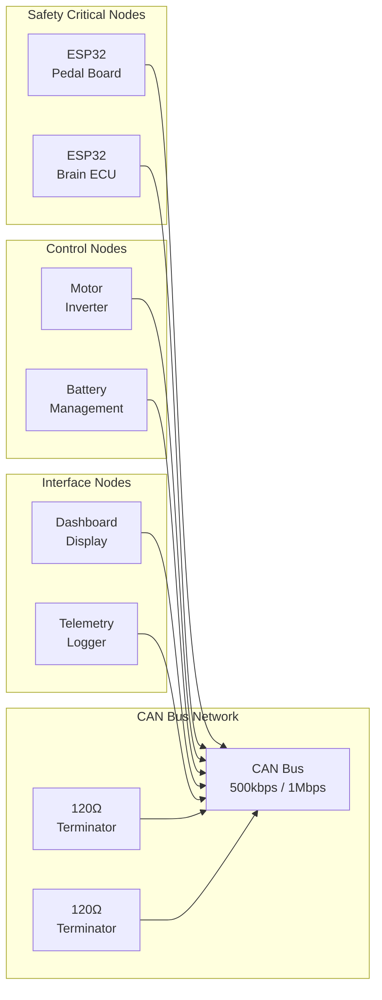

# ESP32 Formula Hybrid Core Library - CAN Protocol Specification

## Purpose
This document defines the CAN bus communication protocol for the ESP32 Formula Hybrid Core Library, including message definitions, timing requirements, and safety considerations.

## Safety Classification
- [x] Safety Critical (CAN communication affects vehicle control and safety)

## Protocol Overview

### **Network Configuration**
- **Bus Speed:** 500 kbps (standard) / 1 Mbps (high-speed option)
- **Frame Format:** Standard CAN 2.0A (11-bit identifiers)
- **Bit Timing:** 125ns bit time @ 1 Mbps, 250ns @ 500 kbps
- **Termination:** 120Ω resistors at both ends of bus
- **Maximum Bus Length:** 100m @ 500 kbps, 40m @ 1 Mbps

### **Message Priority Scheme**
CAN identifiers assigned by priority (lower ID = higher priority):

```
Priority Level    ID Range      Purpose                    Examples
High (0-99)       0x000-0x063   Emergency & Safety         Emergency stop, heartbeats
Medium (100-499)  0x064-0x1F3   Control & Command          Motor control, pedal data
Low (500-2047)    0x1F4-0x7FF   Status & Telemetry         Dashboard, logging
```

## Message Definitions

### **Emergency and Safety Messages (0x000-0x063)**

#### **0x001 - Emergency Stop**
**Purpose:** Immediate system shutdown command
**Priority:** Critical (highest)
**Frequency:** On-demand
**Safety:** Critical

| Byte | Bit 7-4 | Bit 3-0 | Description |
|------|---------|---------|-------------|
| 0    | Source  | Reason  | Emergency source and reason code |
| 1    | Counter | Status  | Message counter and stop status |
| 2-7  | Reserved| Reserved| Reserved for future use |

**Reason Codes:**
- 0x0: Driver emergency stop
- 0x1: System fault detected
- 0x2: External emergency signal
- 0x3: Safety system activation

#### **0x010 - Safety Heartbeat**
**Purpose:** System health monitoring
**Priority:** Critical
**Frequency:** 100ms
**Safety:** Critical

| Byte | Description | Valid Range | Units |
|------|-------------|-------------|-------|
| 0    | Source Node ID | 0x01-0xFE | - |
| 1    | Sequence Counter | 0x00-0xFF | count |
| 2    | System Status | See below | bitfield |
| 3    | Fault Code | 0x00-0xFF | code |
| 4-7  | Reserved | 0x00 | - |

**System Status Bits (Byte 2):**
- Bit 0: System OK
- Bit 1: Warning present
- Bit 2: Fault present
- Bit 3: Emergency stop active
- Bit 4-7: Reserved

### **Control and Command Messages (0x064-0x1F3)**

#### **0x100 - Pedal Data**
**Purpose:** Throttle and brake pedal positions
**Priority:** High
**Frequency:** 10ms
**Safety:** Critical

| Byte | Description | Valid Range | Units | Resolution |
|------|-------------|-------------|-------|------------|
| 0    | Throttle Position 1 | 0-250 | % * 2.5 | 0.4% |
| 1    | Throttle Position 2 | 0-250 | % * 2.5 | 0.4% |
| 2    | Brake Position 1 | 0-250 | % * 2.5 | 0.4% |
| 3    | Brake Position 2 | 0-250 | % * 2.5 | 0.4% |
| 4    | Pedal Status | See below | bitfield | - |
| 5    | Sequence Counter | 0-255 | count | 1 |
| 6-7  | Reserved | 0x00 | - | - |

**Pedal Status Bits (Byte 4):**
- Bit 0: Throttle sensor 1 valid
- Bit 1: Throttle sensor 2 valid
- Bit 2: Brake sensor 1 valid
- Bit 3: Brake sensor 2 valid
- Bit 4: Plausibility check passed
- Bit 5: Brake/throttle conflict
- Bit 6-7: Reserved

#### **0x110 - Motor Control Command**
**Purpose:** Motor torque and speed commands
**Priority:** High
**Frequency:** 10ms
**Safety:** Critical

| Byte | Description | Valid Range | Units | Resolution |
|------|-------------|-------------|-------|------------|
| 0-1  | Torque Request | -32768 to 32767 | Nm * 10 | 0.1 Nm |
| 2-3  | Speed Limit | 0-65535 | RPM | 1 RPM |
| 4    | Control Mode | 0-255 | enum | - |
| 5    | Enable Flags | See below | bitfield | - |
| 6    | Sequence Counter | 0-255 | count | 1 |
| 7    | Checksum | 0-255 | - | - |

**Control Modes (Byte 4):**
- 0x00: Disabled
- 0x01: Torque control
- 0x02: Speed control
- 0x03: Position control
- 0x04: Emergency stop

**Enable Flags (Byte 5):**
- Bit 0: Motor enable
- Bit 1: Regen enable
- Bit 2: Torque limit active
- Bit 3: Speed limit active
- Bit 4-7: Reserved

#### **0x200 - Battery Status**
**Purpose:** Battery pack monitoring data
**Priority:** Medium
**Frequency:** 100ms
**Safety:** Related

| Byte | Description | Valid Range | Units | Resolution |
|------|-------------|-------------|-------|------------|
| 0-1  | Pack Voltage | 0-1000 | V * 10 | 0.1 V |
| 2-3  | Pack Current | -32768 to 32767 | A * 10 | 0.1 A |
| 4    | State of Charge | 0-100 | % | 1% |
| 5    | Temperature | 0-255 | °C + 40 | 1°C |
| 6    | Status Flags | See below | bitfield | - |
| 7    | Fault Code | 0-255 | code | - |

**Status Flags (Byte 6):**
- Bit 0: Charging allowed
- Bit 1: Discharging allowed
- Bit 2: Balancing active
- Bit 3: Thermal warning
- Bit 4: Voltage warning
- Bit 5: Current warning
- Bit 6: Fault present
- Bit 7: Emergency stop

### **Status and Telemetry Messages (0x1F4-0x7FF)**

#### **0x300 - Dashboard Data**
**Purpose:** Driver display information
**Priority:** Low
**Frequency:** 250ms
**Safety:** Non-critical

| Byte | Description | Valid Range | Units | Resolution |
|------|-------------|-------------|-------|------------|
| 0    | Vehicle Speed | 0-255 | km/h | 1 km/h |
| 1    | Motor Speed | 0-255 | RPM / 50 | 50 RPM |
| 2    | Motor Temperature | 0-255 | °C + 40 | 1°C |
| 3    | Battery SoC | 0-100 | % | 1% |
| 4    | System State | 0-255 | enum | - |
| 5    | Warning Flags | See below | bitfield | - |
| 6-7  | Reserved | 0x00 | - | - |

**System States (Byte 4):**
- 0x00: Initialization
- 0x01: Ready
- 0x02: Drive
- 0x03: Fault
- 0x04: Emergency stop

## Communication Requirements

### **Timing Constraints**
- **Critical messages:** < 1ms transmission time
- **Message aging:** Discard messages > 5x normal period
- **Bus utilization:** < 60% average, < 80% peak
- **Latency:** End-to-end < 10ms for control loops

### **Message Timing and Priority**

| Priority Level | ID Range | Message Type | Frequency | Example |
|---------------|----------|--------------|-----------|---------|
| **Emergency (High)** | 0x000-0x063 | Safety Critical | 100ms | Heartbeat, Emergency Stop |
| **Control (Medium)** | 0x064-0x1F3 | Vehicle Control | 10ms | Pedal Data, Motor Commands |
| **Status (Low)** | 0x1F4-0x7FF | Telemetry | 100-250ms | Dashboard, Battery Status |

**Timing Requirements:**
- **Emergency messages:** Immediate transmission (< 1ms)
- **Control messages:** Real-time (10ms cycle)
- **Status messages:** Periodic updates (100-250ms)
- **Maximum bus utilization:** < 60% average, < 80% peak

### **Network Topology**



### **Error Handling**
```cpp
// CAN error handling implementation
class CANErrorHandler {
public:
    enum ErrorType {
        BUS_OFF,
        ERROR_PASSIVE,
        MESSAGE_LOST,
        CHECKSUM_ERROR,
        TIMEOUT
    };
    
    void handle_error(ErrorType error) {
        switch (error) {
            case BUS_OFF:
                attempt_bus_recovery();
                if (recovery_failed()) {
                    enter_safe_mode();
                }
                break;
                
            case MESSAGE_LOST:
                if (is_critical_message()) {
                    trigger_safety_response();
                } else {
                    log_warning();
                }
                break;
                
            case TIMEOUT:
                handle_communication_timeout();
                break;
        }
    }
};
```

### **Message Sequence Monitoring**
```cpp
// Message sequence validation
class MessageSequence {
private:
    uint8_t expected_counter;
    uint32_t last_received_time;
    
public:
    bool validate_sequence(uint8_t counter) {
        uint32_t now = millis();
        
        // Check for missing messages
        if (counter != expected_counter) {
            handle_sequence_error();
            return false;
        }
        
        // Check for timeout
        if (now - last_received_time > MAX_MESSAGE_PERIOD) {
            handle_timeout_error();
            return false;
        }
        
        expected_counter = (counter + 1) % 256;
        last_received_time = now;
        return true;
    }
};
```

## Safety Considerations

### **Message Validation**
- **Sequence counters:** Detect lost or duplicate messages
- **Checksums:** Verify data integrity for critical messages
- **Range checking:** Validate all numeric values
- **Plausibility:** Cross-check related values

### **Fault Detection**
- **Bus monitoring:** Detect bus-off and error states
- **Timeout detection:** Missing message detection
- **Node monitoring:** Heartbeat failure detection
- **Data validation:** Invalid data detection

### **Redundancy**
- **Dual sensors:** Critical measurements use two sensors
- **Alternative paths:** Backup communication methods
- **Graceful degradation:** Reduce functionality vs. complete failure
- **Safe defaults:** Known-good values when communication fails

## Testing and Validation

### **Protocol Testing**
1. **Message timing verification** with oscilloscope
2. **Bus loading analysis** under all operating conditions
3. **Error injection testing** for fault handling validation
4. **Environmental testing** (temperature, vibration, EMI)

### **Compliance Testing**
- **CAN 2.0A standard compliance**
- **Automotive EMC requirements**
- **Racing regulation compliance**
- **Safety standard requirements**

## Implementation Guidelines

### **Node Implementation**
```cpp
// CAN node base class
class CANNode {
protected:
    uint8_t node_id;
    uint32_t heartbeat_interval;
    uint32_t last_heartbeat;
    
public:
    virtual void init() = 0;
    virtual void process_received_message(CANMessage& msg) = 0;
    virtual void send_periodic_messages() = 0;
    
    void send_heartbeat() {
        CANMessage msg;
        msg.id = HEARTBEAT_MSG_ID;
        msg.data[0] = node_id;
        msg.data[1] = sequence_counter++;
        msg.data[2] = get_system_status();
        msg.data[3] = get_fault_code();
        can_bus.send(msg);
    }
};
```

### **Message Handling**
```cpp
// Message processing example
void process_pedal_message(CANMessage& msg) {
    // Validate message format
    if (!validate_message_format(msg)) {
        log_error("Invalid pedal message format");
        return;
    }
    
    // Extract data
    PedalData pedal_data;
    pedal_data.throttle_1 = msg.data[0] * 0.4;
    pedal_data.throttle_2 = msg.data[1] * 0.4;
    pedal_data.brake_1 = msg.data[2] * 0.4;
    pedal_data.brake_2 = msg.data[3] * 0.4;
    pedal_data.status = msg.data[4];
    
    // Validate data ranges and plausibility
    if (!validate_pedal_data(pedal_data)) {
        trigger_safety_response();
        return;
    }
    
    // Process valid data
    update_motor_control(pedal_data);
}
```

---

**Critical Note:** All CAN communication must be thoroughly tested and validated before use in racing applications. Communication failures can have severe safety consequences.

**Next Steps:**
1. Implement base CAN communication classes
2. Create message validation and error handling
3. Develop comprehensive test suite
4. Validate timing and safety requirements