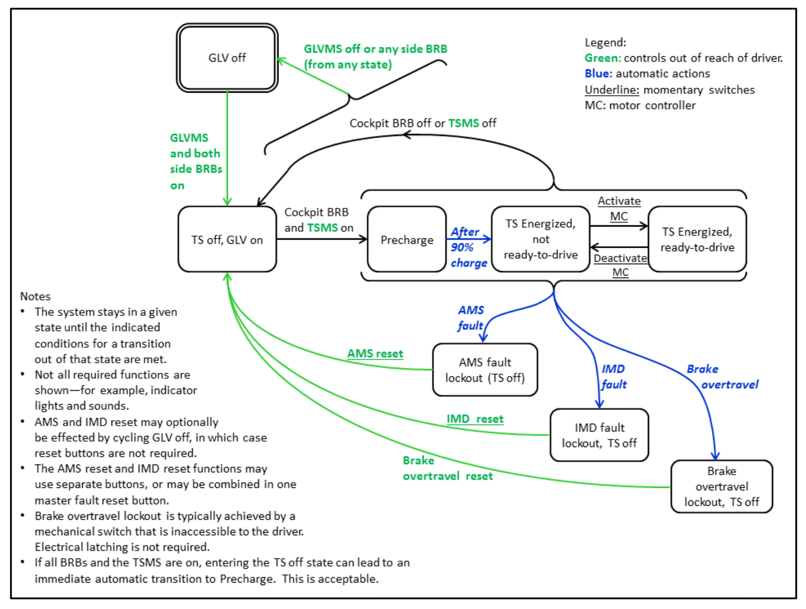
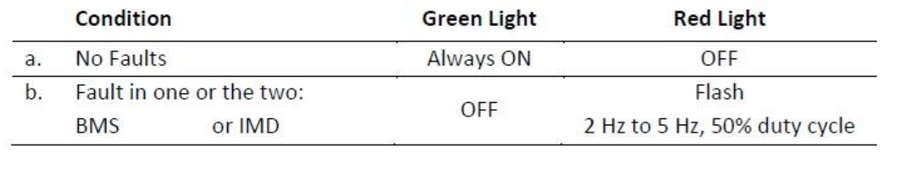

# Software Racing Rules
This document describes in detail each fo the rules that we are obligated to follow as part of building our GLVS (Grounded Low Voltage Sytems).

## Scope
This document lists verbatim from the rule book the rules and regulations.  
This document is based on the 2026 V5 of [the Rule Book](#resources) for Formula E.

## Rules
|Rule|Software Requirement|
|-|-|
|EV 1.2|GLV must not be above 60 VDC or 50 VAC.|
|EV 1.2.2|*IF Accumulator Capacity* is larger than 300V we must complete a form to demonstraiting electrical compeitency, the form is an addendum to ESF-1. (Maximum Accumulator Capacity 5,400 Wh)|
|T1.2.2(p)|Changes to vehicle's software and operating parameters are permitted once the vehicle is approved to compete in dynamic events.|
|EV 2.6.5|Provide generated test data as described in rule.|
|EV 2.10.1|The pre-charge circuit must be disabled if the shutdown circuit is deactivated|
|EV 2.10.1|Pre-charge timing must be based on a voltage measurement of the intermediate circuit voltage compared to the voltage of the accumulator|
|EV 2.10.1|The pre-charge circuit must operate regardless of the sequence of operations used to energize the vehicle|
|EV 2.10.1|Teams should consider failure models when there is a low/medium-impedance short downstream of the pre-charge circuitry, including a welded discharge relay|
|EV 2.10.2|*IF a discharge circuit is needed* it must be designed to handle the maximum expected discharge current for at least 15 seconds. The calculations determining the component values must be part of the ESF.|
|EV 2.11.1|Each accumulator must be monitored by an accumulator management system|
|EV 2.11.2|The AMS must monitor all critical voltages and temperatures in the accumulator as well the integrity of all its voltage and temperature inputs|
|EV 2.11.2|If an out-of-range or a malfunction is detected, it must shut down the electrical systems and open the AIRs.|
|EV 2.11.3|The tractive system must remain disabled until manually reset by a person other than the driver. (Digital logic or microcontrollers may not be used for this function.)|
|EV 2.11.4|The AMS must continuously measure cell voltages in order to keep those voltages inside the allowed minimum and maximums stated in the cell data-sheet. [AMS Voltage Monitoring Table](#ams-voltage-monitoring)|
|EV 2.11.4|If individual cells are directly connected in parallel, only one voltage measurement is required for that group. (Measured at the parallel connections, outside of the cell fuses)|
|EV 2.11.5|The AMS must monitor the temperature of the minimum number of cells in the accumulator as specified in [AMS Temp Monitoring Table](#ams-temperature-monitoring) below. The monitored cells must be equally distributed over the accumulator container(s). NOTE: It is acceptable to monitor multiple cells with one sensor if this sensor has direct contact to all monitored cells. It is also acceptable to use maximum-temperature detection schemes such as diode-paralleled thermisters or zener diodes to monitor multiple cells on a single circuit. NOTE: Teams should monitor the temperature of all cells. NOTE: AMS temperature monitoring at levels less than the requirements in Table 10 may be permitted, on application to the tech committee, for commercial accumulator modules contain integrated temperature sensors.|
|EV 2.11.7|Any GLV connection to the AMS must be galvanically isolated from the TSV. This isolation must be documented in the ESF. NOTE: Per EV2.8.2, AMS connections that are not isolated, such as cell sense wires, cannot exit the accumulator container, unless they are isolated by additional relays when the AIRs are off.|
|EV 2.11.8|Teams may design and build their own Accumulator Management Systems. However, microprocessor-based accumulator management systems are subject to the following restrictions: 1. The processor must be dedicated to the AMS function only. However, it may communicate with other systems through shared peripherals or other physical links. 2. The AMS circuit board must include a watchdog timer. It is strongly recommended that teams include the ability to test the watchdog function in their designs.
|EV2.11.9|The status of the AMS must be shown to the driver by a red indicator light in the cockpit that is easily visible even in bright sunlight. This indicator must show the latched fault rather than instantaneous status of the AMS. Other indication methods may be used upon application for a variance with the rules committee|
|EV 3.5.1|The tractive system motor(s) must be connected to the accumulator through a motor controller. Bypassing the control system and connecting the tractive system accumulator directly to the motor(s) is prohibited.|
|EV 3.5.4|All acceleration control signals (between the accelerator pedal and the motor controller) must have error checking. For analog acceleration control signals, this error checking must detect open circuit, short to ground and short to sensor power. For digital acceleration control signals, this error checking must detect a loss of communication.|
|EV 3.5.5|The accelerator signal limit shutoff may be tested during electrical tech inspection by replicating any of the fault conditions listed in EV3.5.4|
|EV 3.5.6|TS drive motors must spin freely when the TS system is in deactivated state, and when transitioned to a deactivated state.|
|EV 3.5.7|TS circuitry, even at low voltage or current levels, is not allowed in the cockpit. All control signals referenced to TS must be galvanically isolated and referenced to GLV ground.|
|EV 3.6.1|Vehicles with accumulator energy capacities in excess of the limits in Table 1 must be fitted with an Energy Meter provided by the organizer to compete in the endurance event.|
|EV 3.6.2|All power flowing between the accumulator and the Tractive System must pass through the Energy Meter.|
|EV 2.6.3|FH+E does not impose POWER limits and so the only function of the energy meter is to determine valid laps for the endurance event|
|T6.5.1|"Steer-by-wire" or electrically actuated steering is prohibited. The steering wheel must be mechanically connected to the wheels.|
|T6.5.5|Rear wheel steering, which can be electrically actuated, is permitted but only if mechanical stops limit the range of angular movement of the rear wheels to a maximum of six degrees (6°).|
|T6.5.8|If choosing to use steering systems using cables for actuation, the team must submit a failure modes and effects analysis report with design details of the proposed system as part of the Structural Equivalency Spreadsheet (SES).|
|T7.1.5|"Brake-by-wire" systems are prohibited.|
|T7.3.4|The brake over-travel switch must not operate through programmable logic controllers or digital controllers.|
|EV 7.1.1|The shutdown circuit must consist of at least: (1) Grounded Low Voltage Master Switch (GLVMS) See: EV7.3. (2) Tractive System Master Switch (TSMS) See: EV7.4 (3) Two side mounted shutdown buttons (BRBs) See: EV7.5 (4) Cockpit-mounted shutdown button. See: EV7.6 (5) Brake over-travel switch. See: T7.3 (6) A normally open (N.O.) relay controlled by the insulation monitoring device (IMD). See: EV7.9 and Figure 38. (7) A normally open (N.O.) relay controlled by the accumulator management system (AMS). See: EV2.11 and Figure 38. (8) All required interlocks. (9) Both IMD and AMS must use mechanical latching means as described in Appendix G. Latch reset must be by manual push button. Logic-controlled reset is not allowed. (10) If CAN communication are used for safety functions, a relay controlled by an independent CAN watchdog device that opens if relevant CAN messages are not received. This relay is not required to be latching.|
|EV 7.1.2|Any failure causing the GLV system to shut down must immediately deactivate the tractive system as well.|
|EV 7.1.3|In the event of an AMS, IMD or Brake over-travel fault, it must not be possible for the driver to re-activate the tractive system from within the cockpit. This includes "cycling power" through the use of the cockpit shutdown button. Note: Resetting or re-activating the tractive system by operating controls which cannot be reached by the driver26 is considered to be working on the car.|
|EV 7.1.3|Digital logic or microcontrollers may not be used for the safety shutdown loop function; it must be implemented as a series connection (logical AND) of all required safety devices.|
|EV 7.1.6|Electronic systems that contain internal energy storage must be prevented from feeding power back into the vehicle GLV circuits in the event of GLV shutdown.|
|EV 7.5.5|Side-mounted shutdown buttons (BRBs) may not act through logic such as a micro-controller or relays.|
|EV 7.6.4|The cockpit shutdown button must be driver resettable (must be able to restore system operation by pulling the button back out).|
|EV 7.6.5|Cockpit shut-down buttons may not act through logic such as a micro-controller or relays.|
|EV 7.7.1|The GLV system must be powered up before it is possible to activate the tractive system shutdown loop.|
|EV 7.7.2|After enabling the shutdown circuit, at least one action, such as pressing a "start" button must be performed by the driver before the vehicle is "ready to drive". i.e. it will respond to any accelerator input.|
|EV 7.7.3|The "start" action must be configured such that it cannot inadvertently be left in the "on" position after system shutdown.|
|EV 7.8.1|A recommended sequence of operation for the shutdown circuit and related systems is shown in the form of a [state diagram](#shutdown-diagram).Teams must: Demonstrate that their vehicle operates according to this state diagram|
|EV 7.8.2|Teams must demonstrate that their vehicle operates according to the standard shutdown system state diagram, OR obtain approval for an alternative state diagram by submitting an electrical rules query.|
|EV 7.9.2|The IMD must be designed for Electric Vehicle use and meet the following criteria: robustness to vibration, operating temperature range, availability of a direct output, a self-test function, and must not be powered by the system that is monitored. The IMD must be a stand-alone unit. IMD functionality integrated in an AMS is not acceptable (Bender A-ISOMETER ® iso-F1 IR155-3203, IR155-3204, and Iso175C-32-SS are recommended examples)|
|EV 7.9.3|The response value of the IMD needs to be set to no less than 500 ohm/volt, related to the EV7.9.1 maximum tractive system operation voltage.|
|EV 7.9.4|In case of an insulation failure or an IMD failure, the IMD must shut down all the electrical systems and open the AIRs. (Some GLV systems such as accumulator cooling pumps and fans, may remain energized – See Figure 37)|
|EV 7.9.5|Latching circuitry added by teams to comply with IMD/AMS faults must be implemented using electro-mechanical relays. In case of an IMD-related fault, the tractive system must remain disabled until manually reset by a person other than the driver. It must not be possible for the driver to re-activate the tractive system from within the car.|
|EV 7.9.7|The status of the IMD must be displayed to the driver by a red indicator light in the cockpit. (See EV9.4). The indicator must show the latched fault and not the instantaneous status of the IMD. Note: The electrical inspectors will test the IMD by applying a test resistor between tractive system (positive or negative) and GLV system ground. This must deactivate the system. Disconnecting the test resistor may not re-activate the system. i.e. the tractive system must remain inactive until it is manually reset.|
|EV 8.1.6|Vehicles that use CANbus as a fundamental element of the safety shutdown system (e.g., AMS communication) will be required to document and demonstrate shutdown equivalent to BRB operation if CAN communication is interrupted.|
|EV 9.1.5|The Tractive System Status Indicator must show when the GLV System is energized [Indicator Table]()|
|EV 9.2.1|The car must make a characteristic sound, for a minimum of 1 second and a maximum of 3 seconds, when it is ready to drive. Note: The car is ready to drive as soon as the motor(s) will respond to the input of the torque encoder / accelerator pedal.|
|EV 9.2.2|The emitting device must produce a tone between 1000 and 3500 Hz with a minimum loudness of 80dBA measured at any point in a 2m radius around the vehicle from the emitter [examples](https://www.mspindy.com/).|
|EV 9.2.3|The sound level will be measured with a commercial sound level meter from three points, one in the front, and one from each side of the vehicle.|
|EV 9.2.4|The vehicle must not make any other sounds similar to the Ready-to-Drive sound.|
|EV 9.4.1|The status of the IMD must be shown to the driver by a red indicator light in the cockpit that is easily visible even in bright sunlight. This indicator must light up if the IMD detects an insulation failure or if the IMD detects a failure in its own operation e.g. when it loses reference ground.|
|EV 9.4.2|The IMD indicator light must be clearly marked with the lettering "IMD" or "GFD"|
|EV 9.5.2|The accumulator voltage indicator (for removable containers) must be directly controlled by voltage present at the container connectors using analog electronics. No software control is permitted.|
|EV 9.6.1|The status of the AMS must be shown to the driver by a red indicator light in the cockpit that is easily visible even in bright sunlight. This indicator must light up if the AMS detects an accumulator failure or if the AMS detects a failure in its own operation.|
|EV 9.6.2|The AMS indicator light must be clearly marked with the lettering "AMS".|
|EV 10.1.1|The insulation monitoring device will be tested during Electrical Tech Inspection. This is done by connecting a resistor between the TSMP (See Figure 43) and several electrically conductive vehicle parts while the tractive system is active, as shown in the example below.|
|EV 10.1.2|The test is passed if the IMD shuts down the tractive system within 30 seconds at a fault resistance of 250 ohm/volt (50% below the response value). Note: Allowance for the 2 x 10K TSMP resistors can be included in this test.|
|EV 10.4.1|The AMS will be tested in one of two ways: (1) By varying AMS software setpoints so that actual cell voltage is above or below the trip limit. (2) The AMS may be tested by varying simulated cell voltage to the AMS test connector, following open accumulator safety procedures, to make the actual cell voltage above or below the trip limit.|
|EV 10.4.2|The requirement for an AMS test port for commercial accumulator assemblies may be waived, or alternate tests may be substituted, upon application to the rules committee.|
|EV 12.2.15|If charging on the vehicle, AMS and IMD systems must be active during charging. The external charging system must shut down if there is an AMS or IMD fault, or if one of the shutdown buttons (See EV7.5) is pressed. If charging off the vehicle, equivalent AMS and IMD protection must be provided. If charging off the vehicle, the charging cart and any exposed metal must be connected to ac-power ground.|
|IC1.6.2|Accelerator control may be actuated mechanically, electrically or electronically, i.e. electrical Accelerator control (ETC) or "drive-by-wire" is acceptable, provided the system is designed and constructed as a "fail safe" system.|
|IC1.6.4|If electrical or electronic throttle actuation is used, the methodology used to ensure fail-safe operation must be included as a required appendix to the Design Report.|
|ARTICLE EV13|REQUIRED ELECTRICAL DOCUMENTATION|

## Rules by Module

This section groups the rules according to the different software modules to help developers understand which rules apply to their specific module development.

### Core Module
**System-wide requirements that affect all modules:**
- T1.2.2(p) - Software and operating parameter changes permitted  
- EV 7.1.2 - GLV failure must deactivate tractive system
- EV 7.1.6 - Energy storage systems must not feed back to GLV circuits
- EV 8.1.6 - CAN bus safety documentation required

### Battery Module
**AMS and battery monitoring requirements:**
- EV 2.11.1 - Accumulator must be monitored by AMS
- EV 2.11.2 - AMS voltage/temperature monitoring and fault response
- EV 2.11.3 - Manual reset requirement (no digital logic)
- EV 2.11.4 - Continuous cell voltage monitoring
- EV 2.11.5 - Temperature monitoring requirements
- EV 2.11.7 - Galvanic isolation requirements
- EV 2.11.8 - Custom AMS design restrictions
- EV 9.6.1 - AMS status indicator requirements
- EV 9.6.2 - AMS indicator labeling
- EV 10.4.1 - AMS testing procedures
- EV 12.2.15 - AMS operation during charging

### CAN Module
**CAN bus communication and safety:**
- EV 7.1.1 - CAN watchdog relay for safety functions
- EV 8.1.6 - CAN safety documentation and shutdown procedures
- EV 2.11.8 - AMS communication through shared peripherals

### Dash Module
**Display and indicator requirements:**
- EV 9.1.5 - Tractive System Status Indicator
- EV 9.2.1 - Ready-to-drive sound timing
- EV 9.2.2 - Sound frequency and loudness requirements
- EV 9.2.3 - Sound measurement points
- EV 9.2.4 - Unique sound requirement
- EV 9.4.1 - IMD status indicator
- EV 9.4.2 - IMD indicator labeling
- EV 9.5.2 - Accumulator voltage indicator (analog only)
- EV 9.6.1 - AMS status indicator
- EV 9.6.2 - AMS indicator labeling

### Pedals Module
**Accelerator control and safety:**
- IC1.6.2 - Accelerator control
- IC1.6.4 - Accelerator ECF requirements
- EV 3.5.4 - Acceleration signal error checking requirements
- EV 3.5.5 - Accelerator signal testing procedures
- EV 7.7.2 - Start button requirement before ready-to-drive
- EV 7.7.3 - Start action reset requirement
- T7.3.4 - Brake over-travel switch restrictions (no digital logic)

### Inverter Module
**Motor control requirements:**
- EV 3.5.1 - Motor controller requirement (no direct connection)
- EV 3.5.6 - Motor free-spin requirement when TS deactivated
- EV 3.5.7 - TS circuitry isolation from cockpit
- EV 3.6.1 - Energy meter requirement
- EV 3.6.2 - Power flow through energy meter

### Pump Module
**Cooling system operation:**
- EV 7.9.4 - Pumps may remain energized during IMD fault
- EV 12.2.15 - Operation during charging

### IMD Module
**Insulation monitoring requirements:**
- EV 7.9.2 - IMD design and standalone requirements
- EV 7.9.3 - IMD response value (500 ohm/volt minimum)
- EV 7.9.4 - IMD fault response procedures
- EV 7.9.5 - Electro-mechanical latching requirement
- EV 7.9.7 - IMD status display and testing
- EV 9.4.1 - IMD indicator requirements
- EV 9.4.2 - IMD indicator labeling
- EV 10.1.1 - IMD testing procedures
- EV 10.1.2 - IMD test criteria
- EV 12.2.15 - IMD operation during charging

### Shared Safety Requirements
**Rules that apply to multiple modules:**
- EV 1.2 - GLV voltage limits (60 VDC/50 VAC)
- EV 2.6.5 - Generated test data requirements
- EV 2.10.1 - Pre-charge circuit requirements
- EV 7.1.1 - Shutdown circuit components
- EV 7.1.3 - Manual reset requirements and digital logic restrictions
- EV 7.5.5 - BRB button restrictions (no logic)
- EV 7.6.4 - Cockpit shutdown button reset capability
- EV 7.6.5 - Cockpit button logic restrictions
- EV 7.7.1 - GLV power-up sequence
- EV 7.8.1 - Shutdown state diagram compliance
- EV 7.8.2 - State diagram approval process

### Prohibited Systems
**Systems that affect software design decisions:**
- T6.5.1 - Steer-by-wire prohibited
- T7.1.5 - Brake-by-wire prohibited
- General restriction on digital logic in safety-critical paths

## Resources
[The Rule Book](https://drive.google.com/drive/folders/1wQtiOw1vQZO9Khxq5INKgEApLvVv1tpw)

### AMS Voltage Monitoring
|Chemistry|Maximum number of cells per voltage measurement|
|-|-|
|PbAcid|6|
|NiMh|6|
|Lithium based|1|

### AMS Temperature Monitoring
|Chemistry|Cells monitored|
|-|-|
|PbAcid|5%|
|UltraCap|10%|
|NiMh|10%|
|Li-Ion|30%|

### Shutdown Diagram

### Indicator Table
