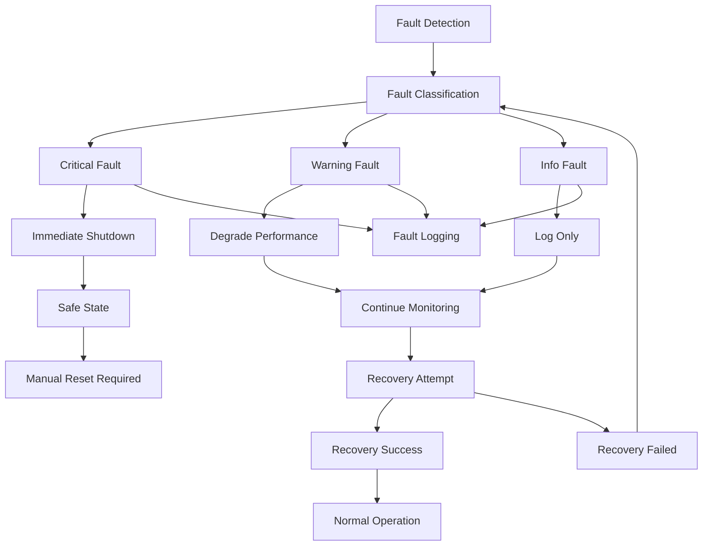

# ESP32 Formula Hybrid Core Library - Safety Requirements

## Purpose
This document defines safety requirements, failure modes, and mitigation strategies for the ESP32 Formula Hybrid Core Library in racing applications.

## Safety Classification
- [x] Safety Critical (this document defines safety requirements for the entire system)

## Safety Philosophy

### **Core Principles**
1. **Fail-Safe Design:** System defaults to safe state on any failure
2. **Defense in Depth:** Multiple layers of protection
3. **Predictable Behavior:** System response to faults is deterministic
4. **Driver Priority:** Driver safety takes precedence over vehicle performance
5. **Testable Safety:** All safety functions must be verifiable

### **Safety Standards Compliance**
- **ISO 26262** concepts applied where applicable
- **Formula Hybrid Rules** compliance
- **SAE J1939** communication standards
- **IEC 61508** functional safety principles

## Safety Requirements

### **SR-001: Emergency Shutdown**
**Requirement:** System shall shut down within 100ms of emergency signal
**Rationale:** Protect driver and vehicle from runaway conditions
**Implementation:** Hardware and software shutdown paths
**Testing:** Automated test with oscilloscope verification

### **SR-002: Pedal Plausibility**
**Requirement:** Throttle and brake pedal signals shall be validated for plausibility
**Rationale:** Prevent unintended acceleration/deceleration
**Implementation:** Dual sensor validation with cross-checking
**Testing:** Fault injection testing with invalid sensor combinations

### **SR-003: Communication Monitoring**
**Requirement:** CAN communication failures shall be detected within 200ms
**Rationale:** Ensure critical control messages are received
**Implementation:** Message sequence counters and timeouts
**Testing:** CAN bus fault simulation

### **SR-004: Motor Torque Limiting**
**Requirement:** Motor torque shall not exceed safe limits under any condition
**Rationale:** Prevent vehicle instability and component damage
**Implementation:** Software and hardware torque limiting
**Testing:** Dynamic testing with torque sensor validation

### **SR-005: Battery Protection**
**Requirement:** Battery systems shall be protected from over-current, over-voltage, and thermal runaway
**Rationale:** Prevent fire, explosion, and electrical hazards
**Implementation:** Multi-level protection with BMS integration
**Testing:** Thermal testing and electrical fault simulation

## Failure Mode and Effects Analysis (FMEA)

### **Critical Failures**

| Component | Failure Mode | Effect | Probability | Severity | Detection | Risk Priority | Mitigation |
|-----------|--------------|--------|-------------|----------|-----------|---------------|------------|
| Pedal Sensor | Open Circuit | Loss of throttle/brake | Medium | High | Good | High | Dual sensors, plausibility check |
| CAN Controller | Bus-off state | Communication loss | Low | High | Good | Medium | Auto-recovery, backup communication |
| Motor Inverter | Overcurrent | Component damage | Low | High | Good | Medium | Current limiting, thermal protection |
| Battery BMS | Cell imbalance | Fire/explosion | Low | Critical | Fair | High | Cell monitoring, thermal management |
| ESP32 MCU | Watchdog reset | System restart | Medium | Medium | Good | Medium | Quick restart, state preservation |

### **Warning Level Failures**

| Component | Failure Mode | Effect | Probability | Severity | Detection | Risk Priority | Mitigation |
|-----------|--------------|--------|-------------|----------|-----------|---------------|------------|
| Temperature Sensor | Drift | Inaccurate readings | High | Low | Fair | Low | Multiple sensors, sanity checks |
| Display | Communication loss | No driver feedback | Medium | Medium | Good | Low | Backup indicators, audio alerts |
| Telemetry | Data loss | No logging | Medium | Low | Good | Low | Local storage, retry mechanisms |

## Fault Handling Strategy

### **Fault Response Flow**



### **Fault Severity Classification**


## Safety Functions Implementation

### **Heartbeat and Monitoring**
```cpp
// Safety heartbeat implementation
class SafetyHeartbeat {
private:
    uint32_t last_heartbeat_ms;
    uint32_t timeout_ms;
    bool safety_state;
    
public:
    void update() {
        uint32_t now = millis();
        if (now - last_heartbeat_ms > timeout_ms) {
            enter_safe_state();
        }
    }
    
    void send_heartbeat() {
        last_heartbeat_ms = millis();
        // Send CAN heartbeat message
    }
    
    void enter_safe_state() {
        // Immediate shutdown sequence
        disable_motor_output();
        activate_emergency_braking();
        signal_fault_condition();
    }
};
```

### **Pedal Plausibility Checking**
```cpp
// Pedal safety validation
class PedalSafety {
private:
    float throttle_1, throttle_2;
    float brake_1, brake_2;
    
public:
    SafetyStatus validate_pedals() {
        // Check sensor agreement
        if (abs(throttle_1 - throttle_2) > MAX_THROTTLE_DEVIATION) {
            return SAFETY_FAULT_THROTTLE_MISMATCH;
        }
        
        // Check brake/throttle conflict
        if (throttle_1 > MIN_THROTTLE && brake_1 > MIN_BRAKE) {
            return SAFETY_FAULT_BRAKE_THROTTLE_CONFLICT;
        }
        
        // Check sensor range validity
        if (throttle_1 < MIN_SENSOR_VALUE || throttle_1 > MAX_SENSOR_VALUE) {
            return SAFETY_FAULT_SENSOR_RANGE;
        }
        
        return SAFETY_OK;
    }
};
```

### **Fault Detection and Response**
```cpp
// Fault management system
class FaultManager {
public:
    enum FaultSeverity {
        INFO,     // Log only
        WARNING,  // Reduce performance
        CRITICAL  // Immediate shutdown
    };
    
    void report_fault(FaultCode code, FaultSeverity severity) {
        log_fault(code, severity);
        
        switch (severity) {
            case CRITICAL:
                immediate_shutdown();
                break;
            case WARNING:
                degrade_performance();
                break;
            case INFO:
                // Continue normal operation
                break;
        }
    }
    
private:
    void immediate_shutdown() {
        // Hardware shutdown sequence
        disable_all_outputs();
        activate_emergency_systems();
        notify_driver();
        enter_safe_mode();
    }
};
```

## Testing Requirements

### **Safety Function Testing**
1. **Unit Tests:** All safety functions must have 100% code coverage
2. **Integration Tests:** Safety functions tested in system context
3. **Hardware-in-Loop:** Testing with actual hardware interfaces
4. **Fault Injection:** Systematic testing of failure scenarios
5. **Environmental Testing:** Temperature, vibration, EMI testing

### **Test Scenarios**
- **Emergency Shutdown Test:** Verify < 100ms shutdown time
- **Sensor Failure Test:** Single and dual sensor failures
- **Communication Fault Test:** CAN bus errors and recovery
- **Power Loss Test:** Graceful handling of power interruptions
- **Thermal Test:** Operation at temperature extremes

### **Validation Methods**
- **Static Analysis:** Code analysis for safety violations
- **Dynamic Testing:** Runtime verification of safety functions
- **Formal Verification:** Mathematical proof of critical algorithms
- **Peer Review:** Independent review of safety implementations

## Operational Safety

### **Pre-Race Checks**
- [ ] All safety functions tested and verified
- [ ] Communication links established and stable
- [ ] Emergency shutdown tested from driver controls
- [ ] Sensor calibration verified
- [ ] Fault injection tests passed

### **During Operation**
- Continuous monitoring of safety-critical functions
- Real-time fault detection and logging
- Driver alerts for non-critical issues
- Automatic degradation for warning-level faults
- Immediate shutdown for critical faults

### **Post-Race Analysis**
- Review fault logs for safety incidents
- Analyze performance of safety systems
- Update safety requirements based on experience
- Prepare safety documentation for technical inspection

## Regulatory Compliance

### **Formula Hybrid Requirements**
- All safety systems documented and tested
- Emergency shutdown accessible to driver
- Fault logging for post-incident analysis
- Safety system independent of performance systems

### **Documentation Requirements**
- Safety case documentation
- Test results and validation reports
- Fault analysis and corrective actions
- Traceability from requirements to implementation

## Safety Culture

### **Development Practices**
- Safety requirements defined before implementation
- Code reviews focus on safety implications
- Testing includes safety validation
- Documentation maintained throughout lifecycle

### **Continuous Improvement**
- Regular safety reviews and updates
- Lessons learned from incidents
- Industry best practice adoption
- Regulatory requirement tracking

---

**Safety is not optional in racing applications. Every design decision must consider safety implications.**

**Next Steps:**
1. Implement core safety functions in base library
2. Create comprehensive test suite for safety validation
3. Establish safety review process for all code changes
4. Document compliance with racing regulations