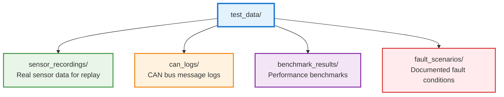

# Testing Procedures and Validation

## Purpose
This document defines test procedures, validation protocols, and simulation strategies for the ESP32 Formula Hybrid Core Library to ensure reliable operation in race car environments.

## Scope
- Unit testing procedures and frameworks
- Integration testing protocols
- Hardware-in-the-loop (HIL) testing
- Simulation and validation strategies
- Safety testing requirements
- Performance benchmarking

## Safety Considerations
⚠️ **CRITICAL**: All testing must be performed in a safe environment. Never test high-voltage or high-current systems without proper safety equipment and procedures.

## Testing Framework Architecture

### Unit Testing (PlatformIO + Unity)

```mermaid
flowchart TD
  test_root["test/"]
  
  test_root --> test_battery["test_battery/<br/>Battery module tests"]
  test_root --> test_can["test_can/<br/>CAN communication tests"]
  test_root --> test_core["test_core/<br/>Core utilities tests"]
  test_root --> test_dash["test_dash/<br/>Dashboard interface tests"]
  test_root --> test_imd["test_imd/<br/>IMD monitoring tests"]
  test_root --> test_inverter["test_inverter/<br/>Inverter control tests"]
  test_root --> test_pedals["test_pedals/<br/>Pedal systems tests"]
  test_root --> test_pump["test_pump/<br/>Pump control tests"]
  test_root --> test_integration["test_integration/<br/>Full system tests"]
  
  style test_root fill:#E3F2FD,stroke:#1976D2,stroke-width:3px
  style test_battery fill:#E8F5E8,stroke:#388E3C,stroke-width:2px
  style test_can fill:#E8F5E8,stroke:#388E3C,stroke-width:2px
  style test_core fill:#E8F5E8,stroke:#388E3C,stroke-width:2px
  style test_dash fill:#E8F5E8,stroke:#388E3C,stroke-width:2px
  style test_imd fill:#FFF3E0,stroke:#F57C00,stroke-width:2px
  style test_inverter fill:#FFF3E0,stroke:#F57C00,stroke-width:2px
  style test_pedals fill:#FFF3E0,stroke:#F57C00,stroke-width:2px
  style test_pump fill:#FFF3E0,stroke:#F57C00,stroke-width:2px
  style test_integration fill:#FFEBEE,stroke:#D32F2F,stroke-width:2px
```



### Test Execution Commands
```bash
# Run all tests
pio test

# Run specific module tests
pio test --filter test_battery
pio test --filter test_can

# Run integration tests
pio test --filter test_integration

# Run with verbose output
pio test --verbose
```

## Unit Testing Standards

### Test Structure
Each test file should follow this pattern:
```cpp
#include <unity.h>
#include "ModuleName.h"

void setUp(void) {
    // Initialize before each test
}

void tearDown(void) {
    // Cleanup after each test
}

void test_module_initialization(void) {
    // Test module begins correctly
    TEST_ASSERT_TRUE(module.begin());
}

void test_module_functionality(void) {
    // Test core functionality
    TEST_ASSERT_EQUAL(expected, actual);
}

int main(int argc, char **argv) {
    UNITY_BEGIN();
    RUN_TEST(test_module_initialization);
    RUN_TEST(test_module_functionality);
    return UNITY_END();
}
```

### Test Coverage Requirements
- **Minimum coverage**: 80% line coverage
- **Critical paths**: 100% coverage for safety-related code
- **Error conditions**: All error paths must be tested
- **Boundary conditions**: Test min/max values and edge cases

## Integration Testing

### System-Level Tests
1. **Power-up sequence testing**
   - Verify all modules initialize in correct order
   - Test startup timing and dependencies
   - Validate initial state of all systems

2. **Communication protocol testing**
   - CAN bus message validation
   - UART communication integrity
   - I2C device enumeration and communication

3. **Real-time performance testing**
   - Loop timing validation (<10ms target)
   - Interrupt response times
   - Task scheduling verification

### Test Scenarios
```cpp
// Example integration test
void test_full_system_startup(void) {
    // Initialize all modules
    TEST_ASSERT_TRUE(battery.begin());
    TEST_ASSERT_TRUE(can.begin());
    TEST_ASSERT_TRUE(imd.begin());
    TEST_ASSERT_TRUE(inverter.begin());
    TEST_ASSERT_TRUE(pedals.begin());
    TEST_ASSERT_TRUE(pump.begin());
    TEST_ASSERT_TRUE(dash.begin());
    
    // Verify system state
    TEST_ASSERT_TRUE(core.isSystemReady());
}
```

## Hardware-in-the-Loop (HIL) Testing

### Wokwi Simulation Testing
- **Purpose**: Validate logic without physical hardware
- **Scope**: All modules except those requiring real sensor data
- **Configuration**: Uses `wokwi` environment in PlatformIO

### Physical Hardware Testing
- **Test bench setup**: Controlled environment with actual sensors
- **Signal injection**: Use function generators for sensor simulation
- **Load testing**: Verify performance under realistic conditions

## Safety Testing Protocols

### Fault Injection Testing
1. **Power supply faults**
   - Under-voltage conditions
   - Over-voltage protection
   - Power supply noise immunity

2. **Communication faults**
   - CAN bus failures (open/short circuits)
   - UART communication errors
   - I2C bus lockup conditions

3. **Sensor faults**
   - Open circuit sensors
   - Short circuit conditions
   - Out-of-range readings

### Emergency Response Testing
- **IMD fault response**: System shutdown within 100ms
- **Overcurrent protection**: Inverter disable functionality
- **Thermal protection**: High temperature response
- **Watchdog testing**: System recovery from software faults

## Performance Testing

### Timing Requirements
- **Main loop execution**: <10ms per cycle
- **CAN message latency**: <5ms from trigger to transmission
- **Sensor reading frequency**: Minimum 100Hz for critical sensors
- **Display update rate**: 10Hz minimum for dashboard

### Memory Usage Testing
- **RAM usage**: Monitor dynamic allocation
- **Flash usage**: Track code size growth
- **Stack usage**: Verify no stack overflow conditions

### Stress Testing
- **Extended operation**: 24-hour continuous operation test
- **Temperature cycling**: -20°C to +70°C operation
- **Vibration testing**: Automotive vibration standards
- **EMI testing**: Electromagnetic interference immunity

## Automated Testing Pipeline

### Continuous Integration (CI)
```yaml
# Example GitHub Actions workflow
name: ESP32 Tests
on: [push, pull_request]

jobs:
  test:
    runs-on: ubuntu-latest
    steps:
      - uses: actions/checkout@v2
      - name: Setup PlatformIO
        run: pip install platformio
      - name: Run Unit Tests
        run: pio test --environment native
      - name: Build All Environments
        run: pio run
```

### Test Reporting
- **Coverage reports**: Generate and track coverage metrics
- **Performance metrics**: Benchmark execution times
- **Regression testing**: Automated comparison with baseline
- **Test documentation**: Auto-generated test reports

## Simulation Strategies

### Wokwi Virtual Hardware
- **Component simulation**: Virtual sensors and actuators
- **Protocol testing**: CAN bus simulation
- **Timing analysis**: Execution profiling
- **Debug capabilities**: Serial monitor and logic analyzer

### Model-Based Testing
- **Sensor models**: Mathematical models for real-world sensors
- **Vehicle dynamics**: Simplified car behavior simulation
- **Environmental conditions**: Temperature, vibration effects
- **Fault modeling**: Systematic fault injection

## Test Data Management

### Test Data Organization



### Data Collection
- **Race day data**: Log actual race conditions
- **Bench testing**: Controlled test environment data
- **Simulation data**: Virtual testing results
- **Failure analysis**: Post-incident data collection

## Validation Protocols

### Pre-Competition Testing
1. **System validation checklist**
2. **Safety system verification**
3. **Performance baseline establishment**
4. **Competition readiness assessment**

### Post-Competition Analysis
1. **Data download and analysis**
2. **System performance review**
3. **Fault log analysis**
4. **Improvement identification**

## Documentation Requirements

### Test Plans
- **Scope and objectives**
- **Test procedures and acceptance criteria**
- **Resource requirements**
- **Risk assessment and mitigation**

### Test Reports
- **Test execution results**
- **Defect tracking and resolution**
- **Performance metrics**
- **Recommendations for improvement**

## Tools and Equipment

### Software Tools
- **PlatformIO**: Build system and test runner
- **Unity**: C unit testing framework
- **Wokwi**: ESP32 simulation platform
- **Logic analyzers**: Protocol verification
- **Oscilloscopes**: Signal integrity analysis

### Hardware Tools
- **Function generators**: Signal injection
- **Power supplies**: Variable voltage testing
- **Multimeters**: Electrical measurements
- **CAN bus analyzers**: Protocol debugging

## References
- [Unity Testing Framework](http://www.throwtheswitch.org/unity)
- [PlatformIO Testing Guide](https://docs.platformio.org/en/latest/plus/unit-testing.html)
- [Wokwi ESP32 Simulator](https://wokwi.com/)
- [Automotive Testing Standards](https://www.iso.org/standard/43464.html)

---
*Last updated: October 2025*  
*Document version: 1.0*  
*Review cycle: Before each testing phase*