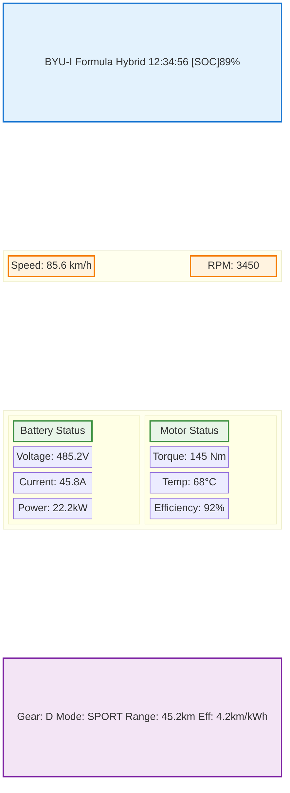
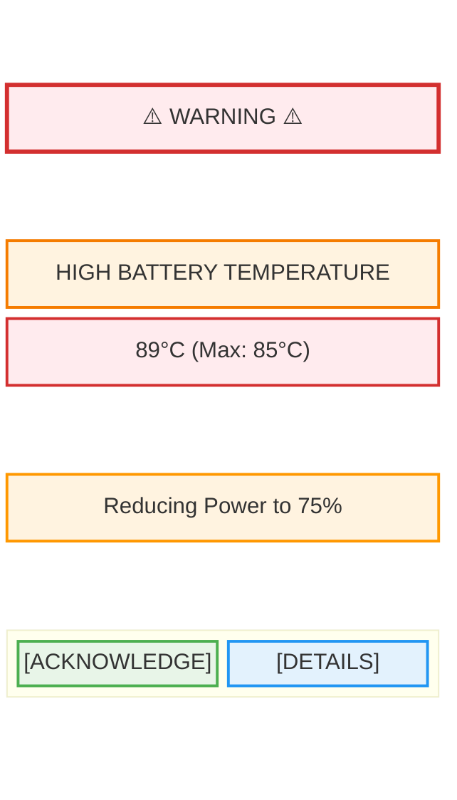

# Dashboard and Display Interface

## Purpose
This document defines the interface and implementation for the dashboard and display system in the ESP32 Formula Hybrid Core Library, providing driver information and vehicle status display.

## Scope
- Display hardware interface and communication
- Driver information presentation
- Alert and warning systems
- Data visualization and graphics
- User interface design standards

## Safety Considerations
⚠️ **CRITICAL**: Dashboard information must be clearly visible and not distract the driver. Critical warnings must be immediately apparent and cannot be missed during racing conditions.

## Module Interface

### Class Definition
```cpp
class DashboardManager {
public:
    bool begin();
    void update();
    
    // Display management
    void clearDisplay();
    void updateDisplay();
    void setBrightness(uint8_t level);
    void setContrast(uint8_t level);
    
    // Data display
    void showSpeed(float speed);
    void showRPM(uint16_t rpm);
    void showBatterySOC(uint8_t percentage);
    void showTemperature(float temp);
    void showEfficiency(float efficiency);
    void showRange(uint16_t range);
    
    // Status indicators
    void showGear(uint8_t gear);
    void showDriveMode(DriveMode mode);
    void showWarnings(uint32_t warningFlags);
    void showFaults(uint32_t faultFlags);
    
    // Alert system
    void showAlert(AlertLevel level, const char* message);
    void clearAlert();
    bool isAlertActive();
    
    // Navigation and menus
    void showMenu(MenuType menu);
    void handleButtonPress(ButtonType button);
    void navigateMenu(MenuDirection direction);
    
private:
    // Implementation details
};
```

### Display Configuration
```cpp
struct DisplayConfig {
    uint8_t displayType;        // OLED, LCD, TFT, etc.
    uint16_t width;             // Display width in pixels
    uint16_t height;            // Display height in pixels
    uint8_t colorDepth;         // Bits per pixel
    uint32_t baudRate;          // Communication speed
    uint8_t brightness;         // Default brightness (0-255)
    uint8_t contrast;           // Default contrast (0-255)
    bool autoBacklight;         // Auto brightness control
    uint16_t timeout;           // Screen timeout in seconds
};
```

## Hardware Interface

### Display Options

#### OLED Display (SSD1306/SSD1309)
- **Resolution**: 128x64 or 128x32 pixels
- **Interface**: I2C (SDA: GPIO21, SCL: GPIO22)
- **Power**: 3.3V, ~20mA
- **Viewing angle**: Wide angle, good in sunlight
- **Response time**: <1ms

#### TFT LCD Display (ILI9341)
- **Resolution**: 320x240 pixels
- **Interface**: SPI (CLK: GPIO18, MISO: GPIO19, MOSI: GPIO23, CS: GPIO5)
- **Power**: 3.3V, ~100mA with backlight
- **Color**: 16-bit RGB565
- **Touch interface**: Optional resistive or capacitive

#### Character LCD (HD44780)
- **Display**: 20x4 or 16x2 characters
- **Interface**: Parallel or I2C (PCF8574 expander)
- **Power**: 5V, ~10mA
- **Backlight**: LED backlight available
- **Cost**: Low cost option

### Button Interface
```
Button    | GPIO Pin | Function
----------|----------|------------------
UP        | GPIO32   | Menu navigation up
DOWN      | GPIO33   | Menu navigation down
LEFT      | GPIO25   | Menu navigation left
RIGHT     | GPIO26   | Menu navigation right
SELECT    | GPIO27   | Menu selection/enter
BACK      | GPIO14   | Menu back/cancel
MODE      | GPIO12   | Change drive mode
```

### LED Indicators
```
LED       | GPIO Pin | Color  | Function
----------|----------|--------|------------------
POWER     | GPIO2    | Green  | System power
READY     | GPIO4    | Blue   | System ready
WARNING   | GPIO16   | Yellow | Warning condition
FAULT     | GPIO17   | Red    | Fault condition
IMD       | GPIO5    | Red    | IMD fault
```

## Display Layout Design

### Main Dashboard Screen



### Warning/Alert Display



## Data Types and Enumerations

### Display Data Structures
```cpp
struct VehicleData {
    float speed;                // km/h
    uint16_t rpm;               // motor RPM
    uint8_t batterySOC;         // percentage
    float batteryVoltage;       // volts
    float batteryCurrent;       // amps
    float batteryPower;         // kW
    float motorTorque;          // Nm
    float motorTemp;            // °C
    uint8_t gear;               // gear position
    DriveMode driveMode;        // drive mode
    float efficiency;           // km/kWh
    uint16_t range;             // remaining range in km
    uint32_t uptime;            // system uptime in seconds
};

enum DriveMode {
    MODE_ECO = 0,
    MODE_NORMAL = 1,
    MODE_SPORT = 2,
    MODE_TRACK = 3
};

enum AlertLevel {
    ALERT_INFO = 0,
    ALERT_WARNING = 1,
    ALERT_CRITICAL = 2,
    ALERT_EMERGENCY = 3
};
```

### Menu System
```cpp
enum MenuType {
    MENU_MAIN = 0,
    MENU_BATTERY = 1,
    MENU_MOTOR = 2,
    MENU_SETTINGS = 3,
    MENU_DIAGNOSTICS = 4,
    MENU_ABOUT = 5
};

enum ButtonType {
    BUTTON_UP = 0,
    BUTTON_DOWN = 1,
    BUTTON_LEFT = 2,
    BUTTON_RIGHT = 3,
    BUTTON_SELECT = 4,
    BUTTON_BACK = 5,
    BUTTON_MODE = 6
};
```

## Implementation Details

### Display Initialization
```cpp
bool DashboardManager::begin() {
    // Initialize display hardware
    if (!display.begin()) {
        return false;
    }
    
    // Set initial parameters
    display.clearDisplay();
    display.setTextSize(1);
    display.setTextColor(SSD1306_WHITE);
    
    // Show startup screen
    showStartupScreen();
    delay(2000);
    
    // Initialize button inputs
    initializeButtons();
    
    // Initialize LED outputs
    initializeLEDs();
    
    return true;
}
```

### Main Display Update
```cpp
void DashboardManager::update() {
    // Handle button inputs
    handleButtonInputs();
    
    // Update display content based on current screen
    switch (currentScreen) {
        case SCREEN_MAIN:
            updateMainScreen();
            break;
        case SCREEN_BATTERY:
            updateBatteryScreen();
            break;
        case SCREEN_MOTOR:
            updateMotorScreen();
            break;
        case SCREEN_SETTINGS:
            updateSettingsScreen();
            break;
    }
    
    // Handle alerts
    if (alertActive) {
        showActiveAlert();
    }
    
    // Update LED indicators
    updateLEDIndicators();
    
    // Refresh display
    display.display();
}
```

### Main Screen Display
```cpp
void DashboardManager::updateMainScreen() {
    display.clearDisplay();
    
    // Header with time and SOC
    display.setCursor(0, 0);
    display.printf("BYU-I Formula   %02d:%02d:%02d [SOC]%d%%", 
                   hours, minutes, seconds, vehicleData.batterySOC);
    
    // Speed and RPM (large text)
    display.setTextSize(2);
    display.setCursor(10, 20);
    display.printf("%.1f km/h", vehicleData.speed);
    
    display.setCursor(10, 40);
    display.printf("RPM: %d", vehicleData.rpm);
    
    // Battery info
    display.setTextSize(1);
    display.setCursor(0, 60);
    display.printf("Batt: %.1fV %.1fA %.1fkW", 
                   vehicleData.batteryVoltage,
                   vehicleData.batteryCurrent,
                   vehicleData.batteryPower);
    
    // Status line
    display.setCursor(0, 55);
    display.printf("G:%d M:%s R:%.1fkm E:%.1fkm/kWh",
                   vehicleData.gear,
                   getModeString(vehicleData.driveMode),
                   vehicleData.range,
                   vehicleData.efficiency);
}
```

### Alert System
```cpp
void DashboardManager::showAlert(AlertLevel level, const char* message) {
    currentAlert.level = level;
    strncpy(currentAlert.message, message, sizeof(currentAlert.message) - 1);
    currentAlert.timestamp = millis();
    currentAlert.acknowledged = false;
    alertActive = true;
    
    // Set LED indicator based on alert level
    switch (level) {
        case ALERT_WARNING:
            digitalWrite(WARNING_LED_PIN, HIGH);
            break;
        case ALERT_CRITICAL:
        case ALERT_EMERGENCY:
            digitalWrite(FAULT_LED_PIN, HIGH);
            break;
    }
    
    // Force immediate display update
    showActiveAlert();
    display.display();
}

void DashboardManager::showActiveAlert() {
    // Save current display state
    uint8_t* displayBuffer = display.getBuffer();
    
    // Clear and show alert
    display.clearDisplay();
    
    // Alert header
    const char* alertText = (currentAlert.level >= ALERT_CRITICAL) ? "⚠️ CRITICAL ⚠️" : "⚠️ WARNING ⚠️";
    display.setTextSize(1);
    display.setCursor(getCenteredX(alertText), 0);
    display.print(alertText);
    
    // Alert message
    display.setTextSize(1);
    display.setCursor(getCenteredX(currentAlert.message), 20);
    display.print(currentAlert.message);
    
    // Acknowledgment prompt
    display.setCursor(getCenteredX("[SELECT] to acknowledge"), 50);
    display.print("[SELECT] to acknowledge");
    
    // Flash for critical alerts
    if (currentAlert.level >= ALERT_CRITICAL && (millis() % 1000) < 500) {
        display.invertDisplay(true);
    } else {
        display.invertDisplay(false);
    }
}
```

### Button Handling
```cpp
void DashboardManager::handleButtonInputs() {
    static uint32_t lastButtonTime = 0;
    static ButtonType lastButton = BUTTON_NONE;
    
    // Debounce timing
    if (millis() - lastButtonTime < BUTTON_DEBOUNCE_MS) {
        return;
    }
    
    // Read button states
    ButtonType pressedButton = readButtons();
    
    if (pressedButton != BUTTON_NONE && pressedButton != lastButton) {
        lastButtonTime = millis();
        lastButton = pressedButton;
        
        // Handle alert acknowledgment first
        if (alertActive && pressedButton == BUTTON_SELECT) {
            acknowledgeAlert();
            return;
        }
        
        // Handle mode button globally
        if (pressedButton == BUTTON_MODE) {
            cycleDriveMode();
            return;
        }
        
        // Handle navigation based on current screen
        switch (currentScreen) {
            case SCREEN_MAIN:
                handleMainScreenButtons(pressedButton);
                break;
            case SCREEN_MENU:
                handleMenuButtons(pressedButton);
                break;
            case SCREEN_SETTINGS:
                handleSettingsButtons(pressedButton);
                break;
        }
    }
}
```

## Graphics and Visualization

### Battery SOC Indicator
```cpp
void DashboardManager::drawBatteryIndicator(uint8_t soc, uint16_t x, uint16_t y) {
    const uint8_t width = 30;
    const uint8_t height = 15;
    
    // Draw battery outline
    display.drawRect(x, y, width, height, SSD1306_WHITE);
    display.drawRect(x + width, y + 3, 3, height - 6, SSD1306_WHITE);
    
    // Calculate fill level
    uint8_t fillWidth = (width - 2) * soc / 100;
    
    // Fill battery based on SOC
    if (fillWidth > 0) {
        display.fillRect(x + 1, y + 1, fillWidth, height - 2, SSD1306_WHITE);
    }
    
    // Add percentage text
    display.setCursor(x + width + 8, y + 4);
    display.printf("%d%%", soc);
}
```

### Signal Strength Indicator
```cpp
void DashboardManager::drawSignalBars(uint8_t strength, uint16_t x, uint16_t y) {
    const uint8_t barWidth = 3;
    const uint8_t barSpacing = 1;
    const uint8_t maxHeight = 12;
    
    for (uint8_t i = 0; i < 5; i++) {
        uint8_t barHeight = (maxHeight * (i + 1)) / 5;
        
        if (i < strength) {
            display.fillRect(x + i * (barWidth + barSpacing), 
                           y + maxHeight - barHeight, 
                           barWidth, barHeight, SSD1306_WHITE);
        } else {
            display.drawRect(x + i * (barWidth + barSpacing), 
                           y + maxHeight - barHeight, 
                           barWidth, barHeight, SSD1306_WHITE);
        }
    }
}
```

## Communication Protocol

### UART Communication with ESP32
```cpp
struct DashboardMessage {
    uint8_t header;             // Message start marker (0xAA)
    uint8_t messageType;        // Message type identifier
    uint8_t length;             // Data payload length
    uint8_t data[32];          // Message data
    uint8_t checksum;          // Simple checksum
};

enum MessageType {
    MSG_VEHICLE_DATA = 0x01,
    MSG_ALERT = 0x02,
    MSG_SETTINGS = 0x03,
    MSG_COMMAND = 0x04
};
```

### Message Processing
```cpp
void DashboardManager::processReceivedMessage() {
    if (Serial.available() >= sizeof(DashboardMessage)) {
        DashboardMessage msg;
        Serial.readBytes((uint8_t*)&msg, sizeof(msg));
        
        // Verify header and checksum
        if (msg.header == 0xAA && verifyChecksum(msg)) {
            switch (msg.messageType) {
                case MSG_VEHICLE_DATA:
                    updateVehicleData(msg.data);
                    break;
                case MSG_ALERT:
                    processAlert(msg.data);
                    break;
                case MSG_SETTINGS:
                    updateSettings(msg.data);
                    break;
            }
        }
    }
}
```

## Configuration and Settings

### Display Settings
```cpp
struct DashboardSettings {
    uint8_t brightness;         // 0-255
    uint8_t contrast;           // 0-255
    uint8_t colorScheme;        // Color theme
    uint8_t units;              // Imperial/Metric
    uint16_t screenTimeout;     // Auto-off timeout
    bool autoBacklight;         // Auto brightness
    uint8_t alertTimeout;       // Alert display time
    bool soundEnabled;          // Beeper enable
};
```

### User Preferences
```cpp
struct UserPreferences {
    uint8_t language;           // Display language
    uint8_t temperatureUnit;    // Celsius/Fahrenheit
    uint8_t speedUnit;          // km/h or mph
    uint8_t efficiencyUnit;     // km/kWh or mi/kWh
    bool showAdvancedData;      // Technical data display
    uint8_t startupScreen;      // Default startup screen
};
```

## Testing and Validation

### Display Testing
- Pixel accuracy and alignment
- Color reproduction and contrast
- Brightness control functionality
- Response time measurement
- Viewing angle testing

### User Interface Testing
- Button response and debouncing
- Menu navigation flow
- Alert visibility and timing
- Text readability in various conditions
- Ergonomic assessment

### Environmental Testing
- Temperature range operation
- Vibration resistance
- Sunlight readability
- Moisture resistance
- EMI immunity

## Performance Requirements

### Display Performance
- **Update rate**: Minimum 10Hz for main display
- **Response time**: <100ms for button presses
- **Alert response**: <50ms for critical alerts
- **Boot time**: <3 seconds to functional display

### Power Consumption
- **Typical operation**: <100mA at 3.3V
- **Standby mode**: <10mA
- **Backlight**: Additional 50-200mA depending on brightness

## References
- [SSD1306 OLED Display Datasheet](https://cdn-shop.adafruit.com/datasheets/SSD1306.pdf)
- [ILI9341 TFT Display Controller](https://cdn-shop.adafruit.com/datasheets/ILI9341.pdf)
- [Formula Hybrid Dashboard Requirements](https://www.sae.org/programs/student-competitions/formula-hybrid/)
- [Automotive HMI Standards](https://www.iso.org/standard/59317.html)

---
*Last updated: October 2025*  
*Document version: 1.0*  
*Review cycle: Before each competition season*