# Observer Pattern with Boost.Signals2 (C++)

A practical walkthrough of the **Observer Pattern** in modern C++ using **Boost.Signals2**.  
Subjects emit strongly-typed signals, and observers connect callable slots—no need for manual attach/detach lists.

---

## Index
- [Introduction](#introduction)
- [Project Structure](#project-structure)
- [Dependencies](#dependencies)
- [Full Code Listing](#full-code-listing)
  - [Pedal.h](#pedalh)
  - [Pedal.cpp](#pedalcpp)
  - [Dashboard.h](#dashboardh)
  - [Dashboard.cpp](#dashboardcpp)
  - [main.cpp](#maincpp)
- [How It Works](#how-it-works)
- [Observer Pattern Diagram](#observer-pattern-diagram)

---

## Introduction

According to *Head First Design Patterns (2nd Edition)*:  
> "The Observer Pattern defines a one-to-many dependency between objects so that when one object changes state, all of its dependents are notified and updated automatically."

In simple terms:  
When a **Subject** changes its state, it **notifies** all of its **Observers**.

In object-oriented design, it's common to define **interfaces** (contracts) that only specify the types of parameters and return values.  
By clearly defining these contracts, we ensure **encapsulation**, reduce **coupling**, and prevent interference between functionalities, even as parts of the system evolve independently.

In this project, we use **Boost.Signals2** to express that contract as a **strongly-typed signal**.  
Instead of the class knowing about concrete observers, it simply **emits events**—and any connected observer is notified automatically.

---

## Usage Example - Project Structure

```
observer-pattern/
├── src/
│   ├── Pedal.h         # Subject class: defines and exposes the signal (positionChanged)
│   ├── Pedal.cpp       # Emits the signal when the pedal's state changes
│   ├── Dashboard.h     # Observer class: declares update(pedalName, value)
│   ├── Dashboard.cpp   # Implements update() to print state changes
│   └── main.cpp        # Connects signals and observers with lambdas
```

---

## Dependencies

- **Boost.Signals2** (header-only library)
 ---

## Full Code Listing

### Pedal.h

```cpp
#pragma once
#include <string>
#include <boost/signals2.hpp>

namespace signals = boost::signals2; // Short alias for convenience

// ----------------------
// Subject Class: Pedal
// ----------------------
// Represents a car pedal (e.g., Accelerator, Brake).
// When its position changes, it emits a signal to notify all observers.
class Pedal {
private:
    int position = 0;       // Pedal position (0 to 100)
    std::string name;       // Pedal name, e.g., "Accelerator"

public:
    // Signal that will be emitted when pedal position changes.
    // Signature: void(const std::string& pedalName, int value)
    // - pedalName: the name of the pedal emitting the signal
    // - value: the new pedal position (0–100)
    signals::signal<void(const std::string&, int)> positionChanged;

    // Constructor: initializes pedal with a name
    explicit Pedal(std::string pedalName);

    // Sets the pedal position and emits a signal to observers
    void setPosition(int newPos);

    // Returns the current pedal position
    int getPosition() const { return position; }

    // Returns the name of the pedal
    const std::string& getName() const { return name; }
};
```

### Pedal.cpp

```cpp
#include "Pedal.h"

// Constructor: initialize the pedal with its name
Pedal::Pedal(std::string pedalName) : name(std::move(pedalName)) {}

// Update pedal position and emit a signal to all observers
void Pedal::setPosition(int newPos) {
    position = newPos;
    // Emit the signal — every connected observer will be notified
    positionChanged(name, position);
}
```

### Dashboard.h

```cpp
#pragma once
#include <string>

// ----------------------------
// Observer Class: DashboardDisplay
// ----------------------------
// This class listens for updates from Pedal objects
// and displays the current pedal position.
class DashboardDisplay {
public:
    // Receives updates from the Subject (Pedal)
    void update(const std::string& pedalName, int value);
};
```

### Dashboard.cpp

```cpp
#include "Dashboard.h"
#include <iostream>

// Implementation of the update() method
// Prints pedal updates to the console
void DashboardDisplay::update(const std::string& pedalName, int value) {
    std::cout << "[Dashboard] " << pedalName
              << " pedal position: " << value << "%\n";
}
```

### main.cpp

```cpp
#include "Pedal.h"
#include "Dashboard.h"

int main() {
    // Create Pedal instances (Subjects)
    Pedal accelerator("Accelerator");
    Pedal brake("Brake");
    Pedal clutch("Clutch");

    // Create one Dashboard (Observer)
    DashboardDisplay display;

    // Connect each pedal's signal to the Dashboard's update method
    // Each connection registers a lambda that calls display.update()
    accelerator.positionChanged.connect([
        &display](const std::string& name, int value) { display.update(name, value); });
    brake.positionChanged.connect([
        &display](const std::string& name, int value) { display.update(name, value); });
    clutch.positionChanged.connect([
        &display](const std::string& name, int value) { display.update(name, value); });

    // Changing the pedal positions will automatically notify the dashboard
    accelerator.setPosition(30); // Triggers an update to observers
    brake.setPosition(10);
    clutch.setPosition(50);

    return 0;
}
```

---

## How It Works

1. **Connect once**:  
   Each `connect` call registers a function (lambda) that matches the signal's signature and calls `DashboardDisplay::update`.

2. **Emit later**:  
   When `setPosition()` is called, it changes the internal state and triggers  
   `positionChanged(name, value)`, notifying all connected observers.

3. **Decoupled design**:  
   The `Pedal` class doesn't know who is listening—it simply emits a signal.  
   Observers can be added, removed, or replaced without changing the `Pedal` class itself.

---
## Observer Pattern Diagram

```mermaid
classDiagram
    class Pedal {
        -int position
        -string name
        +positionChanged : signal
        +Pedal(string pedalName)
        +setPosition(int newPos) void
        +getPosition() int
        +getName() string
    }

    class DashboardDisplay {
        +update(string pedalName, int value) void
    }

    class MainApp {
        +main() int
    }

    Pedal --> DashboardDisplay : emits signal
    DashboardDisplay ..> Pedal : connects to
    MainApp ..> Pedal : creates
    MainApp ..> DashboardDisplay : creates
    
    note "Subject: Emits positionChanged signal when setPosition() is called"
    note "Observer: Receives updates via connected lambda"
```

