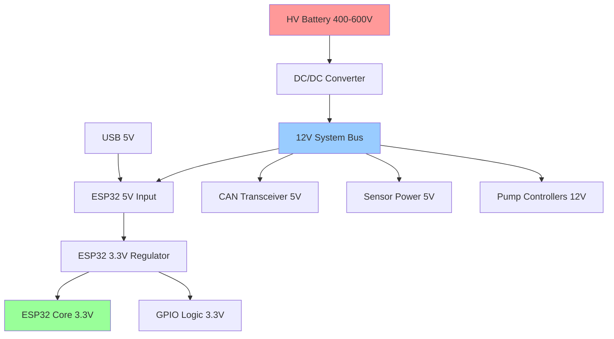
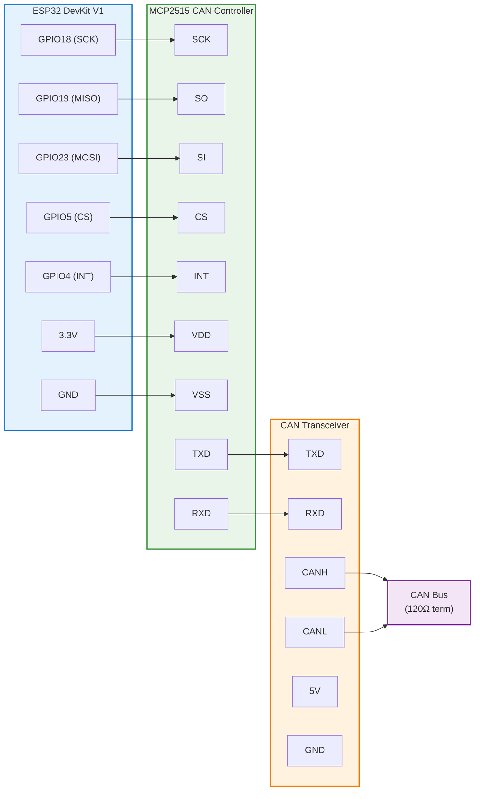
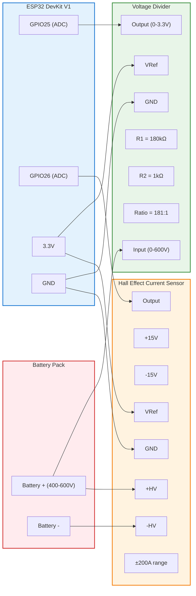
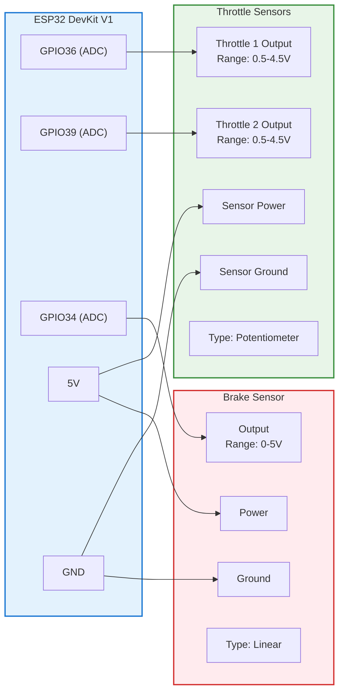

# Electrical Diagrams and Connection Specifications

## Purpose
This document provides detailed electrical diagrams, wiring specifications, and connection details for the ESP32 Formula Hybrid Core Library implementation.

## Scope
- ESP32 DevKit V1 pinout and connections
- Module interface diagrams
- Power distribution schemes
- Signal routing specifications
- Connector and cable specifications

## ESP32 DevKit V1 Complete Pinout

### Pin Assignment Overview

```mermaid
block-beta
  columns 1
  title["ESP32 DevKit V1 Pinout"]
  space
  
  block:esp32_board
    columns 2
    
    block:left_pins
      columns 1
      EN["EN"]
      A0["ADC2_0/A0"]
      A3["ADC2_3/A3"]
      A6["ADC2_6/A6"]
      A7["ADC2_7/A7"]
      A4["ADC2_4/A4"]
      A5["ADC2_5/A5"]
      A8["ADC2_8/A8"]
      VDD_3V3["3V3"]
      GND_1["GND"]
      D10["ADC2_9/A9/D10"]
      D11["ADC2_8/A8/D11"]
      D12["Touch9/A12/D12"]
      D13["Touch8/A13/D13"]
      GND_2["GND"]
    end
    
    block:right_pins
      columns 1
      D0["D0/GPIO3 (Boot Button)"]
      D1["D1/GPIO1 (TX0 - USB Serial)"]
      D2["D2/GPIO2 (LED_BUILTIN)"]
      D3["D3/GPIO3 (RX0 - USB Serial)"]
      D4["D4/GPIO4 (CAN RX)"]
      D5["D5/GPIO5 (CAN TX)"]
      D6["D6/GPIO6 (Reserved)"]
      D7["D7/GPIO7 (Reserved)"]
      D8["D8/GPIO8 (Reserved)"]
      D9["D9/GPIO9 (Reserved)"]
      D10_R["D10/GPIO10 (Reserved)"]
      D11_R["D11/GPIO11 (Reserved)"]
      D12_R["D12/GPIO12 (IMD Status)"]
      D13_R["D13/GPIO13 (Pump PWM)"]
      D14["D14/GPIO14 (Brake Input)"]
    end
  end
  
  space
  additional_title["Additional GPIO (bottom row):"]
  
  block:additional_pins
    columns 4
    D15["D15/GPIO15<br/>(Pedal Input)"]
    D16["D16/GPIO16<br/>(Dashboard TX)"]
    D17["D17/GPIO17<br/>(Dashboard RX)"]
    D18["D18/GPIO18<br/>(SPI CLK)"]
    D19["D19/GPIO19<br/>(SPI MISO)"]
    D21["D21/GPIO21<br/>(I2C SDA)"]
    D22["D22/GPIO22<br/>(I2C SCL)"]
    D23["D23/GPIO23<br/>(SPI MOSI)"]
    D25["D25/GPIO25<br/>(Battery Voltage)"]
    D26["D26/GPIO26<br/>(Battery Current)"]
    D27["D27/GPIO27<br/>(Inverter Enable)"]
    D32["D32/GPIO32<br/>(Flow Sensor)"]
    D33["D33/GPIO33<br/>(Pressure Sensor)"]
    D34["D34/GPIO34<br/>(Temperature 1)"]
  end
  
  style title fill:#E3F2FD,stroke:#1976D2,stroke-width:2px
  style additional_title fill:#F3E5F5,stroke:#7B1FA2,stroke-width:1px
  style left_pins fill:#E8F5E8,stroke:#388E3C,stroke-width:2px
  style right_pins fill:#FFF3E0,stroke:#F57C00,stroke-width:2px
  style additional_pins fill:#FFEBEE,stroke:#D32F2F,stroke-width:2px
```


```
                    ESP32 DevKit V1
                  ┌─────────────────┐
              EN  │1               30│ D0/GPIO3     (Boot Button)
        ADC2_0/A0 │2               29│ D1/GPIO1     (TX0 - USB Serial)
        ADC2_3/A3 │3               28│ D2/GPIO2     (LED_BUILTIN)
        ADC2_6/A6 │4               27│ D3/GPIO3     (RX0 - USB Serial)  
        ADC2_7/A7 │5               26│ D4/GPIO4     (CAN RX)
        ADC2_4/A4 │6               25│ D5/GPIO5     (CAN TX)
        ADC2_5/A5 │7               24│ D6/GPIO6     (Reserved)
        ADC2_8/A8 │8               23│ D7/GPIO7     (Reserved)
              3V3 │9               22│ D8/GPIO8     (Reserved)
              GND │10              21│ D9/GPIO9     (Reserved)
   ADC2_9/A9/D10  │11              20│ D10/GPIO10   (Reserved)
  ADC2_8/A8/D11   │12              19│ D11/GPIO11   (Reserved)
  Touch9/A12/D12  │13              18│ D12/GPIO12   (IMD Status)
  Touch8/A13/D13  │14              17│ D13/GPIO13   (Pump PWM)
              GND │15              16│ D14/GPIO14   (Brake Input)
                  └─────────────────┘
                  
        Additional GPIO (bottom row):
        D15/GPIO15  (Pedal Input)
        D16/GPIO16  (Dashboard TX)
        D17/GPIO17  (Dashboard RX)
        D18/GPIO18  (SPI CLK)
        D19/GPIO19  (SPI MISO)
        D21/GPIO21  (I2C SDA)
        D22/GPIO22  (I2C SCL)
        D23/GPIO23  (SPI MOSI)
        D25/GPIO25  (Battery Voltage)
        D26/GPIO26  (Battery Current)
        D27/GPIO27  (Inverter Enable)
        D32/GPIO32  (Flow Sensor)
        D33/GPIO33  (Pressure Sensor)
        D34/GPIO34  (Temperature 1)
        D35/GPIO35  (Temperature 2)
        D36/SVP     (Throttle 1)
        D39/SVN     (Throttle 2)
```

## Power Distribution System

### Main Power Architecture


### Power Requirements
```
Component                | Voltage | Current  | Power
------------------------|---------|----------|--------
ESP32 DevKit V1         | 5V      | 250mA    | 1.25W
CAN Transceiver         | 5V      | 50mA     | 0.25W
Display (OLED)          | 3.3V    | 30mA     | 0.1W
Sensors (total)         | 3.3V    | 100mA    | 0.33W
Status LEDs             | 3.3V    | 60mA     | 0.2W
Total 3.3V Load         | 3.3V    | 440mA    | 1.45W
Total 5V Load           | 5V      | 300mA    | 1.5W
Total System Power      | -       | -        | 3.0W
```

## Module Connection Diagrams

### CAN Bus Interface



### Battery Management Interface



### Pedal Position Interface



### IMD Interface
```
ESP32 DevKit V1           Optocoupler                   IMD Device
┌─────────────┐          ┌─────────────────────┐        ┌─────────────┐
│             │          │                     │        │             │
│GPIO12 (IN)  │◄─────────┤ Output              │        │             │
│        3.3V ├─────────►│ VCC                 │        │             │
│         GND ├─────────►│ GND                 │        │             │
│             │          │                     │        │             │
└─────────────┘          │ 4N35 Optocoupler    │        │             │
                         │                     │        │             │
                         │                 LED ├───────►│ Status Out  │
                         │                 GND ├───────►│ Ground      │
                         │                     │        │             │
                         └─────────────────────┘        │ 12V     ────┼──► 12V Supply
                                                        │ GND     ────┼──► Ground
                                                        └─────────────┘
                                                        
ESP32 DevKit V1           PWM Frequency Input           
┌─────────────┐          ┌─────────────────────┐        
│             │          │                     │        
│GPIO13 (IN)  │◄─────────┤ Output              │        
│        3.3V ├─────────►│ VCC                 │        
│         GND ├─────────►│ GND                 │        
│             │          │                     │        
└─────────────┘          │ Level Shifter       │        
                         │ (5V to 3.3V)        │        
                         │                 IN  ├───────►│ PWM Out     │
                         │                 GND ├───────►│ Ground      │
                         └─────────────────────┘        └─────────────┘
```

### Pump Control Interface
```
ESP32 DevKit V1           PWM Driver                    Pump Controller
┌─────────────┐          ┌─────────────────────┐        ┌─────────────┐
│             │          │                     │        │             │
│GPIO13 (PWM) ├─────────►│ PWM Input           │        │             │
│GPIO16 (EN)  ├─────────►│ Enable Input        │        │             │
│             │          │                     │        │             │
│        3.3V ├─────────►│ Logic VCC           │        │             │
│         GND ├─────────►│ Logic GND           │        │             │
│             │          │                     │        │             │
└─────────────┘          │ MOSFET Driver       │        │             │
                         │                     │        │             │
                         │            Output + ├───────►│ PWM Input + │
                         │            Output - ├───────►│ PWM Input - │
                         │                     │        │             │
                         │               12V   ├───────►│ Power +     │
                         │               GND   ├───────►│ Power -     │
                         └─────────────────────┘        └─────────────┘
                                                        Brushless DC
                                                        Pump Controller
```

## Connector Specifications

### Main System Connectors

#### Power Connector (12V Input)
```
Connector: Phoenix Contact MVSTBR 2.5/2-STF
Pin 1: +12V (Red wire, 16 AWG)
Pin 2: GND  (Black wire, 16 AWG)
Rating: 12A, 250V
```

#### CAN Bus Connector
```
Connector: Phoenix Contact MVSTBR 2.5/3-STF
Pin 1: CANH (White/Orange wire, 20 AWG twisted pair)
Pin 2: CANL (Orange wire, 20 AWG twisted pair)
Pin 3: Shield/GND (Drain wire)
Rating: 8A, 250V
```

#### Sensor Connector (M12 x 1, 4-pin)
```
Pin 1: Sensor Power (+5V or +12V)
Pin 2: Sensor Ground
Pin 3: Signal Output
Pin 4: Shield/Screen (if applicable)
Cable: Shielded, 4-conductor, 22 AWG
Length: 2-5 meters typical
```

### Dashboard Connector
```
Connector: JST XH 2.54mm, 6-pin
Pin 1: +5V Power (Red)
Pin 2: Ground (Black)
Pin 3: TX Data (Yellow)
Pin 4: RX Data (Green)
Pin 5: Button Input (Blue)
Pin 6: Backlight Control (White)
```

## Cable Specifications

### High-Speed Digital Signals
```
CAN Bus:
- Cable: Belden 3082A or equivalent
- Impedance: 120Ω ±5%
- Capacitance: <40 pF/m
- Maximum length: 40m at 500kbps
- Termination: 120Ω at each end

SPI Signals:
- Cable: Ribbon cable or twisted pair
- Maximum length: 0.5m
- Ground plane recommended
- Impedance matching not critical at <10MHz

I2C Signals:
- Cable: Twisted pair with shield
- Maximum length: 2m
- Pull-up resistors: 4.7kΩ
- Capacitance limit: 400pF total
```

### Analog Sensor Signals
```
Voltage Sensors:
- Cable: Shielded twisted pair
- Shield connected at control end only
- Maximum length: 10m
- Input impedance: >1MΩ

Current Sensors:
- Cable: Shielded twisted pair
- Differential signaling preferred
- Maximum length: 5m
- Common mode rejection >60dB

Temperature Sensors:
- Cable: Thermocouple or RTD cable
- Shielded for EMI protection
- Compensation for lead resistance
- Maximum length: 20m
```

### Power Cables
```
12V Power Distribution:
- Wire gauge: 16 AWG minimum
- Insulation: 600V rating
- Color coding: Red (+), Black (-)
- Fusing: 10A automotive fuse

Motor Power (HV):
- Wire gauge: 10 AWG minimum
- Insulation: 1000V rating
- Color coding: Orange for HV
- Shielding: Required for EMI

Pump Power:
- Wire gauge: 18 AWG
- Insulation: 300V rating
- Protection: 5A fuse per pump
- Relay control: 12V coil
```

## Grounding and Shielding

### Grounding Architecture
```
                    Vehicle Chassis Ground
                           │
                    ┌──────┴──────┐
                    │             │
              Signal Ground   Power Ground
                    │             │
            ┌───────┼───────┐     │
            │       │       │     │
        ESP32   Sensors  Display  │
        3.3V     5V      3.3V     │
         GND     GND      GND     │
            │       │       │     │
            └───────┼───────┘     │
                    │             │
               Single Point    12V System
               Ground Star     Ground Bus
                    │             │
                    └──────┬──────┘
                           │
                    Safety Ground
                    (Chassis Bond)
```

### EMI Shielding Guidelines
```
Shield Connection Rules:
1. Signal shields: Connect at control end only
2. Power shields: Connect at both ends
3. Chassis shield: Connect to chassis ground
4. 360° shield termination preferred

Shield Materials:
- Aluminum foil: Good for magnetic fields
- Copper braid: Good for electric fields
- Mu-metal: Excellent for low-frequency magnetic

Cable Routing:
- Separate power and signal cables
- Maintain 6" minimum separation
- Cross at 90° angles when necessary
- Use ferrite beads on problem cables
```

## Installation Guidelines

### Mounting Specifications
```
ESP32 DevKit V1 Mounting:
- Use plastic standoffs (M2.5 x 10mm)
- Maintain 10mm clearance around board
- Protect from moisture and vibration
- Operating temperature: -40°C to +85°C

Enclosure Requirements:
- IP54 rating minimum
- Ventilation for cooling
- EMI gaskets for RF shielding
- Strain relief for all cables
```

### Testing and Validation
```
Continuity Testing:
- All connections <0.1Ω resistance
- Insulation >10MΩ between circuits
- Shield continuity <1Ω

Signal Integrity:
- Rise time <10% of clock period
- Overshoot <10% of signal amplitude
- Crosstalk <5% between adjacent signals

Power Quality:
- Ripple <100mV peak-to-peak
- Noise <50mV RMS
- Regulation ±5% of nominal
```

## Troubleshooting Guide

### Common Wiring Issues
```
Problem: Intermittent connections
Causes: Poor crimps, vibration, corrosion
Solution: Re-crimp, add strain relief, use gold contacts

Problem: EMI interference
Causes: Poor shielding, ground loops, cable routing
Solution: Improve shields, single-point grounding, separate cables

Problem: Voltage drops
Causes: Undersized wires, poor connections, high resistance
Solution: Larger conductors, better connections, voltage sensing

Problem: Ground loops
Causes: Multiple ground paths, poor grounding design
Solution: Single-point grounding, isolate signal grounds
```

### Test Equipment Required
```
Multimeter: 
- Fluke 87V or equivalent
- DC voltage accuracy ±0.05%
- Resistance measurement to 50MΩ

Oscilloscope:
- 100MHz bandwidth minimum
- 4 channels preferred
- Differential probes for high voltage

Logic Analyzer:
- 16 channels minimum
- 100MHz sample rate
- Protocol decode capability

Power Supply:
- Variable 0-15V, 5A
- Current limiting
- Ripple <10mV RMS
```

---
*Last updated: October 2025*  
*Document version: 1.0*  
*Review cycle: Before each competition season*