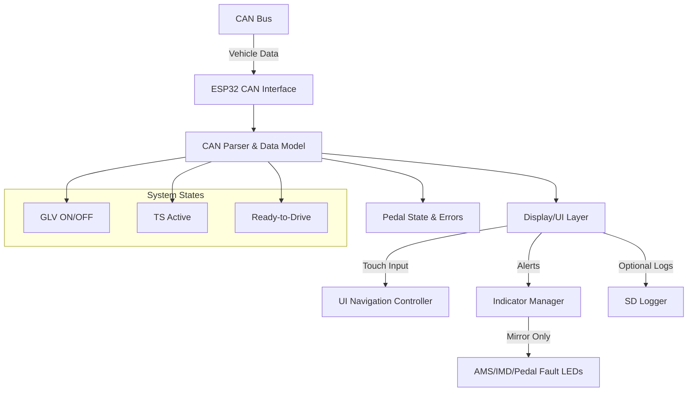
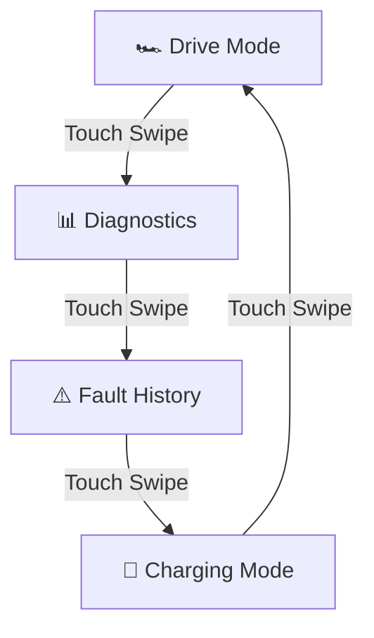
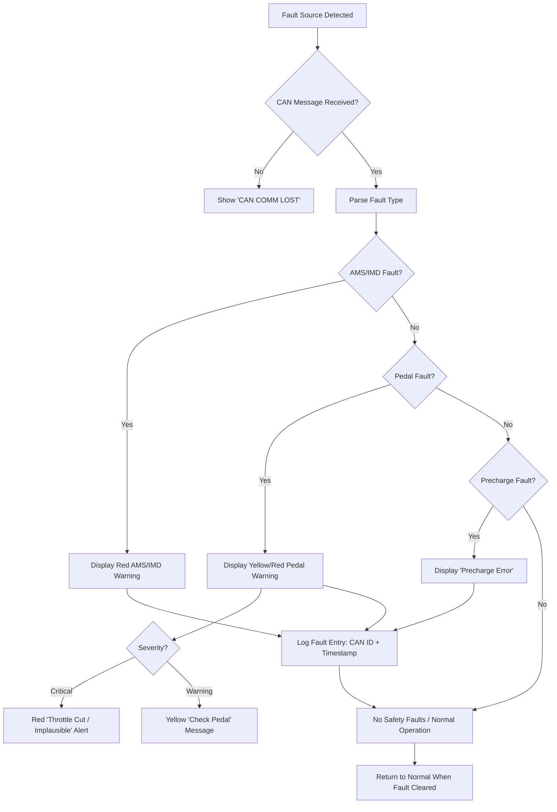

**Feature: Driver Display Interface**

## **Description:**

The race car display interface provides a real-time communication and visualization layer between the driver and the vehicle’s electrical systems.
It reads data from the CAN bus via the ESP32 to display safety-critical information (AMS, IMD, precharge, pedals, etc.), performance data (speed, torque, voltage), and system states (GLV, TS, Ready-to-Drive).
This feature ensures compliance with Formula SAE Electric regulations for driver indication, fault monitoring, and system visibility — particularly rules **EV 8.1.6, EV 9.1.5, EV 9.4.x, and EV 9.6.x.**

---

## **Requirements:**

* [ ] **System Status Display:** Show GLV, Tractive System, and Ready-to-Drive states clearly.
* [ ] **Fault Indicators:** Display AMS and IMD faults as red latched indicators, remaining active until reset.
* [ ] **CAN Data Visualization:** Show accumulator voltage, current, temperatures, and motor parameters (RPM, torque, speed).
* [ ] **Pedal Status & Fault Display:** Display accelerator percentage, brake press state, and pedal warnings or faults from CAN (error codes 1–15).
* [ ] **Precharge Monitoring:** Reflect precharge timing completion and voltage match.
* [ ] **Communication Loss Handling:** If CAN data is not received for >500 ms, display “CAN COMM LOST.”
* [ ] **Touch Interface:** Enable navigation between pages (Drive, Diagnostics, Faults, Charging).
* [ ] **Visibility:** Display remains visible in full sunlight and fault indicators easily distinguishable.
* [ ] **Safe Behavior:** Display only mirrors AMS/IMD and pedal fault states — **never** participates in safety loop logic.
* [ ] **Data Integrity:** Ignore invalid or stale CAN frames.
* [ ] **(Optional)** Log telemetry and fault data for later analysis.

---

## **Tech Refinement:**

### **Hardware Overview**

| Component       | Description                                             |
| --------------- | ------------------------------------------------------- |
| ESP32           | Central processor handling CAN and touchscreen I/O      |
| Touchscreen LCD | 4.3–7" TFT screen with LVGL-based UI                    |
| CAN Transceiver | MCP2551 or SN65HVD230 connected to ESP32 TWAI interface |
| Power           | GLV 12 V → 5 V DC converter                             |
| Optional        | SD Card module for telemetry logs                       |

---

### **Software Architecture**

---

### **Page Layout Structure**

#### **Page 1: Drive Mode**

* **Top:** TS: ON/OFF | GLV: ON/OFF | Ready-to-Drive
* **Middle:** AMS ⚠️ | IMD ⚠️ | Pedal Fault ⚠️ | CAN Status
* **Bottom:** Voltage | Current | Speed | Motor RPM | Throttle % | Brake ON/OFF

#### **Page 2: Diagnostics**

* Cell voltage min/max
* Cell temperature distribution
* Pedal sensor 1 & 2 raw ADC values
* Pedal error codes decoded to readable text (e.g., “Slew Rate Critical”)
* CAN message status indicators

#### **Page 3: Fault History**

* Timestamped list of AMS, IMD, and Pedal faults
* Each entry includes source (e.g., “Pedal Pot 1 Sync Critical”) and CAN ID
* Touch to expand details

#### **Page 4: Charging Mode**

* Pack SOC
* Charging voltage/current
* AMS/IMD active status during charge
* Charging fault messages

---

### **CAN Signal Mapping (Updated)**

| Signal        | CAN ID | Byte | Length | Scale   | Units | Source           | Notes                                             |
| ------------- | ------ | ---- | ------ | ------- | ----- | ---------------- | ------------------------------------------------- |
| Pack Voltage  | 0x101  | 0    | 2      | 0.1     | V     | AMS              | From accumulator                                  |
| Pack Current  | 0x101  | 2    | 2      | 0.1     | A     | AMS              | From accumulator                                  |
| Max Cell Temp | 0x102  | 0    | 2      | 0.1     | °C    | AMS              | Highest cell temperature                          |
| AMS Fault     | 0x103  | 0    | 1      | Bitmask | –     | AMS              | 1 = Fault                                         |
| IMD Fault     | 0x104  | 0    | 1      | Bitmask | –     | IMD              | 1 = Fault                                         |
| Motor RPM     | 0x201  | 0    | 2      | 1       | RPM   | Motor Controller | –                                                 |
| TS Active     | 0x301  | 0    | 1      | Bool    | –     | VCU              | 1 = Active                                        |
| Pedal Data    | 0x401  | 0–7  | 8      | –       | –     | Pedal Module     | Includes throttle %, brake, ADCs, and error codes |
| CAN Heartbeat | 0x3FF  | 0    | 1      | Bool    | –     | System           | Used to detect comm loss                          |

---

### **Error & Warning Display Mapping**

| Source                   | Condition                   | Display Behavior                                  | Reset Condition            |
| ------------------------ | --------------------------- | ------------------------------------------------- | -------------------------- |
| AMS Fault                | CAN (0x103)                 | Red AMS indicator, freeze voltage display         | Manual reset               |
| IMD Fault                | CAN (0x104)                 | Red IMD indicator, warning banner                 | Manual reset               |
| Pedal Pot 1/2 Fault      | CAN (0x401, error code > 0) | Yellow ⚠️ with fault text (“Pot 1 Slew Critical”) | When code returns to 0     |
| Pedal Plausibility Error | CAN (0x401, sync fault)     | Red ⚠️ “Pedal Implausible”                        | When sensors match again   |
| CAN Loss                 | Timeout > 500 ms            | “CAN COMM LOST” banner                            | Comm restored              |
| Precharge Fault          | Voltage mismatch            | “PRECHARGE ERROR” alert                           | System reset               |
| Overtemp / Undervolt     | AMS signal                  | Highlight in red                                  | When normal range restored |

---

### **Fault Flow Diagram**

---

## **Dependencies:**

* AMS firmware publishing CAN data for cell voltage, temp, and fault state.
* IMD with CAN or discrete fault signal available to ESP32.
* Pedal module transmitting CAN frame (0x401) with error codes and ADC data.
* Motor controller CAN protocol for torque, RPM, and temperature.
* LVGL graphics library for touchscreen UI.
* ESP-IDF CAN (TWAI) driver and FreeRTOS task scheduling.
* (Optional) SD or UART for telemetry logging.

---

## **Notes:**

* Display must **not** control any safety-critical relays or throttle behavior.
* All pedal errors (codes 1–15) are **mirrored** on the display only.
* Display shows clear distinction between **Warning (Yellow)** and **Critical (Red)**.
* Pedal sync and slew warnings must be visually persistent for ≥2 seconds.
* Use color-coded icons:

  * 🟢 Normal
  * 🟡 Warning
  * 🔴 Critical
* Test compliance with **EV 3.5.4**, **EV 7.1.3**, and **EV 8.1.6** during system validation.
* Future enhancement: integrate with diagnostics page for real-time pedal trace plotting.